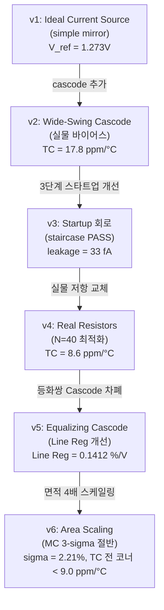

# BGR Core Design Journey (v1 ~ v6)

This document records the step-by-step engineering journey, design decisions, failure analyses, and verified results for the Bandgap Reference (BGR) core.

---

## 1. BGR 설계 여정 개요 (v1 ~ v6)

---

## 2. 각 버전별 상세 여정 및 실측 데이터

### 2.1. v1: Ideal Current Source + Simple Mirror
* **시뮬레이션 결과:**
  * 전류 복사 오차: **`+4.64 %`** (M5 복사 분지 오차)
  * 핵심 등화쌍 입력 미스매치: **`1.05 %`**
  * 출력 기준 전압 $V_{ref}$: **`1.273 V`**
* **원인 분석:**
  * PMOS 전류 미러의 유한한 출력 저항 및 채널 길이 변조 효과 ($\lambda$)에 기인합니다. 각 브랜치의 드레인 전압이 서로 비대칭적으로 형성되어, 게이트 전위가 같음에도 복사되는 전류가 어긋나는 현상이 발생했습니다.
* **개선 설계:**
  * 상단 PMOS 미러에 cascode 단을 추가하여 드레인 전압을 묶고 출력 저항 $r_o$를 증폭시키는 구조를 도입했습니다.
* **개선 결과:**
  * 복사 오차가 **`0.082 %`** (57배 개선)로 급감하였으며, 미스매치도 **`0.018 %`** 수준으로 소거되었습니다.

---

### 2.2. v2: Wide-Swing Cascode + 실물 Bias 체인
* **시뮬레이션 결과:**
  * 실리콘 칩으로 제작하기 위해 이상 전류원(Ideal current source)을 전면 제거하고 스스로 기동하는 자율 바이어스(Self-bias) 구조로 전환이 요구되었습니다.
* **원인 분석:**
  * 바이어스 전압인 `V_bias` 노드에 전류 싱크(sink) 경로가 없으면 노드가 3.3V로 완전히 풀업(pull-up)되어 cascode 소자들이 모두 꺼져 회로가 동작 불능 상태에 고착됩니다.
* **개선 설계:**
  * PMOS 미러 구조에 대칭되는 NMOS 미러 구조(방향 반전)를 추가하여 `V_bias` 노드에 전류 싱크 경로를 자율 생성하도록 설계했습니다.
* **개선 결과:**
  * 이상 소자 0개의 완전한 실물 소자 회로를 구현하였으며, 자율 바이어스 루프 하에서 tt 코너 온도 안정도 **`17.8 ppm/°C`**를 무난히 확보하였습니다.
  * **부수적 발견:** 바이어스 전류 복사 체인의 채널 길이 변조 오차로 인해 전류 오차가 **`+14 %`** 발생하였으나, `XM_bias` 다이오드 결선 노드의 로그(log) 압축 민감도로 인해 `V_bias` 이동이 단 **`40 mV`**에 그쳤으며, 이 오차는 cascode 마진이 가볍게 흡수하였습니다. 즉, 바이어스 공급 체인은 높은 복사 정밀도를 요구하지 않음을 실증하였습니다.

---

### 2.3. v3: Startup 회로 개발 (3라운드 설계 진화)
* **1라운드 (R1) 결과 및 분석:**
  * 킥 경로가 루프 기동 후에도 상시 차단되지 않고 **`9.23 µA`**가 누설되어 흐름. 출력 전압 $V_{ref} = \mathbf{2.91\,\text{V}}$로 치솟는 제3의 원치 않는 안정점(fake equilibrium)에 고착됨.
  * *원인:* 다이오드 차단 방식이 단순 저항 비율 싸움으로 설계되어, 전원 전압 변동에 대해 차단 평형점이 극도로 민감하게 요동침.
  * *해결:* 감지 노드의 논리 스위칭 오프(Inverter-based switch-off) 기법을 도입하여 디지털 방식의 완전 차단으로 변경.
* **2라운드 (R2) 결과 및 분석:**
  * 전원 전압이 서서히 인가되는 Slow-ramp 조건에서 BJT가 꺼진 상태로 가짜 평형($V(VBE1) = 0.459\,\text{V}$, $V_{ref} = 0.476\,\text{V}$)을 형성하고 기동이 정지됨.
  * *원인:* 감지점이던 `V_bias_n` 노드가 로그 압축되어 꺼진 상태(0.86V)와 켜진 상태(0.92V)의 전압 차이가 매우 조밀하여 인버터가 오작동함.
  * *해결:* 감지 노드를 에미터 전압인 `VBE1`으로 전면 변경. `VBE1`은 BJT의 Turn-on 여부에 따라 **`0.46 V` 대 `0.78 V`**로 이진(binary)에 준하는 넓은 스윙 폭을 가져 가짜 평형 상태의 고착을 구조적으로 차단함.
* **3라운드 (R3) 결과 및 개선:**
  * tt 코너는 기동에 성공했으나 저온/지연 코너(ss/-40°C)에서 차단 트랜지스터의 약화로 **`383 nA`**의 기동 전류 누설이 발생하고 출력 전압이 **`+90 mV`** 오염됨.
  * *원인:* 풀다운 트랜지스터 `XM_pd`와 PMOS 누설 전류 사이의 비례 경쟁에서 ss 코너의 스위칭 마진이 거의 0에 수렴함.
  * *해결:* `XM_pd`의 폭($W$)을 $4\,\mu\text{m} \rightarrow 12\,\mu\text{m}$로 3배 확장하여 설계 마진을 전 코너로 확대.
  * *최종 결과:* 정상 기동 완료 후 스타트업 회로 누설 전류가 **`33 fA`** (tt) / **`0.026 fA`** (ss/-40°C)로 완벽히 소거되었으며, 계단파(staircase) 및 슬로우 램프 고문 테스트를 전 코너에서 안정적으로 통과(PASS)함.

---

### 2.4. v4: 실물 저항 (res_high_po_0p69) 마이그레이션
* **시뮬레이션 결과:**
  * 실물 저항 교체로 인해 기생 접촉 저항(contact resistance)이 더해져 저항 절대값이 설계 대비 **`-4.5 %`** 감소하였으며, 이에 따라 코어 브랜치 전류가 **`+4.6 %`** 증가함.
  * 그러나 최종 기준 출력 전압 $V_{ref}$의 중심값 변동은 단 **`0.03 %`**에 그침.
* **원인 분석:**
  * Banba current-mode BGR 구조의 강점으로, $V_{ref}$는 저항의 절대값이 아니라 오직 저항의 **상대적 비율($R_2/R_6$, $R_2/R_1$)**로만 결정되므로 공정 및 기생 저항 절대값 오차가 회로적으로 완벽히 상쇄됨을 입증함.
* **개선 설계:**
  * 동일 단위 유닛 저항($R_u = 2.95\,\text{k}\Omega$, $W=0.69\,\mu\text{m}$)의 정수배 배치를 전제로 스키매틱 길이를 보정 수식에 맞춰 변경하고 $N$ 스윕을 수행함.
* **결과:**
  * 온도 계수(TC)가 이상 저항의 $17.8\,\text{ppm}/^\circ\text{C}$ 대비 **`8.6 ppm/°C`** (tt 코너)로 오히려 향상됨. 실물 poly 저항의 2차 온도계수 잔차가 BJT의 ln(T) 곡률을 기생적으로 2차 보상(curvature correction)하는 부수적 효과를 발견함.

---

### 2.5. v5: 등화쌍 NMOS Cascode 차폐 (Line Regulation 수술)
* **시뮬레이션 결과:**
  * 실물 저항 최적화 후 Line Regulation 측정 결과 **`0.6405 %/V`**로 목표 스펙인 $<0.5\,\%/V$를 미달함 (VAPWR 2.7~3.6V 구간 스윕 시 $V_{ref}$가 $8.1\,\text{mV}$ 변동).
* **원인 분석:**
  * 하단 등화쌍 중 `XM4` 드레인은 VAPWR을 1:1 추종하는 `V_gate_top` 노드인 반면, `XM3` 드레인은 루프에 의해 고정된 `V_mid1` 노드임. 이 드레인 전압 비대칭성($V_{DS}$ 차이)이 VAPWR의 함수로 변동하여 등화쌍 입력 오프셋을 VAPWR 의존적으로 교란시킴 ($\pm 725\,\mu\text{V}$ 변동).
* **실패한 두 차례의 시도:**
  1. **XM3/XM4 채널 길이 확대 (L 2 ➔ 8):** 출력 저항을 4배 높였으나 변동 오차가 $590\,\mu\text{V}$로 **단 19% 개선**에 그침. 람다 변조 효과보다 $V_{DS}$ 비대칭 구조 자체가 오프셋을 지배함을 확인 (L=2 롤백).
  2. **바이어스 미러 L 확대 (L 2 ➔ 4):** 바이어스 전류 감소로 `V_bias` 전위가 치솟아 상단 PMOS의 헤드룸 마진이 무너져 Line Reg가 `1.75 %/V`로 오히려 폭발함 (롤백).
* **개선 설계:**
  * 등화쌍 위에 NMOS Cascode 단(`XM3c/XM4c`)을 얹어 드레인을 차폐하고, 게이트를 VAPWR 영향과 무관한 GND 기준 Diode-스택 바이어스 브랜치(`V_casc_n` $\approx 2.28\,\text{V}$)에 결선함.
* **개선 결과:**
  * Line Regulation이 **`0.1412 %/V`** (4.5배 개선)로 대폭 향상되었으며, 등화쌍 오프셋의 VAPWR 의존성이 $-725\,\mu\text{V} \rightarrow \mathbf{-51\,\mu V}$ (14배 개선)로 격감함.
  * 오프셋 제거로 PTAT/CTAT 균형점이 정합되어 $N$을 41로 조율하였고, 최종 tt 코너 TC가 **`6.1 ppm/°C`**로 대폭 개선됨.

---

### 2.6. v6: 핵심 소자 면적 4배 스케일링 (Monte Carlo 대응)
* **시뮬레이션 결과 (Before vs After 정량 비교):**
  동일한 회로 토폴로지에서 핵심 소자(`XM_top1/2/5` 및 `XM3/XM4`)만 기존 W10/L2에서 W20/L4로 면적을 4배 확장한 결과입니다.

  | 항목 | 스케일링 전 (before) | 스케일링 후 (after) | 개선 비율 / 비용 |
  | :--- | :---: | :---: | :---: |
  | **MC 표준 편차 ($\sigma$)** | `3.83 %` | **`2.21 %`** | **1.73배 개선** |
  | **MC 3-sigma 범위 ($\pm 3\sigma$)** | `±11.5 %` | **`±6.6 %`** | 분산 기준 절반 수축 |
  | **TC (typical 코너, tt)** | **`6.1 ppm/°C`** | `7.5 ppm/°C` | 미미한 대역 손실 |
  | **TC (slow 코너, ss)** | `11.4 ppm/°C` | **`8.6 ppm/°C`** | **개선** |
  | **TC (fast 코너, ff)** | `48.7 ppm/°C` | **`9.0 ppm/°C`** | **5.4배 개선** (코너 편차 소멸) |
  | **Line Regulation** | `0.1413 %/V` | **`0.0840 %/V`** | **1.7배 개선** |
  | **등화 오차 VAPWR 의존성** | $-51.0\,\mu\text{V}$ | **$-32.6 \mu\text{V}$** | **1.6배 개선** |
  | **소모 전류 ($I_Q$)** | `56.4 µA` | **`59.7 µA`** | $+3.3\,\mu\text{A}$ (추가 비용) |

* **원인 분석:**
  * MM(Local Mismatch)과 PR(Global Process Variation) 분해 분석 결과, 로컬 미스매치(MM)의 분산 기여도가 **`91.5 %`** ($\sigma = 4.58\%$)로 지배적이었습니다. Pelgrom 법칙($\sigma_{Vth} \propto 1/\sqrt{WL}$)에 근거하여 전류 정확도에 직결되는 핵심 소자의 면적을 4배 확장한 결과, 실제 토탈 $\sigma$가 약 절반에 근접한 **`2.21%`**로 수축함을 실측하여 예측의 유효성을 통계적으로 증명하였습니다.
* **스케일링의 다차원적 효과:**
  * **(a) 무작위 오프셋 억제:** 로컬 미스매치 감축을 통해 3-sigma 산포 한계가 $\pm 6.6\%$로 줄어들어 디지털 트림 설계 범위($\pm 7\%$) 내로 확실하게 들어오게 되었습니다.
  * **(b) Systematic 채널 길이 변조 효과 해소:** 채널 길이 $L$이 $2\mu\text{m} \rightarrow 4\mu\text{m}$로 2배 확대되면서 출력 저항 $r_o$가 2배가 되었습니다. 특히 빠른 소자 특성으로 인해 $\lambda$ 변조 오차에 극도로 취약했던 ff 코너의 온도 계수(TC)가 **`48.7 ppm/°C`에서 `9.0 ppm/°C`로 격감**하여, 전 코너 온도 계수가 **`7.5 ~ 9.0 ppm/°C`** 수준에서 거의 완벽한 균일화를 이루었습니다 (코너 편차의 완전 소멸).
* **설계 비용 평가:**
  * 스케일링으로 인해 소모 전류가 **`+3.3 µA`** 가산되어 BGR 코어 소모 전력이 $197\,\mu\text{W}$가 되었고 다이 면적이 약 $+960\,\mu\text{m}^2$ 증가하였으나, 이로 인해 확보한 극적인 미스매치 억제 및 코너 안정성 정합 이득 대비 매우 합리적이고 타당한 트레이드오프로 판단됩니다.

