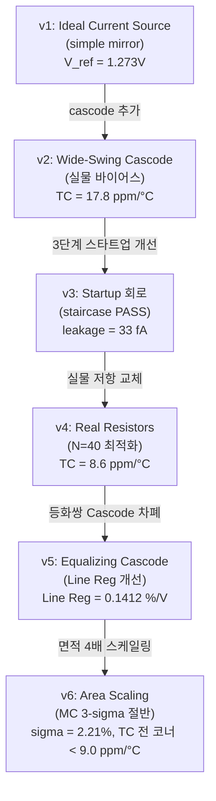

,# BGR Core Design Journey (v1 ~ v6)

This document records the step-by-step engineering journey, design decisions, failure analyses, and verified results for the Bandgap Reference (BGR) core.

---

## 1. BGR 설계 여정 개요 (v1 ~ v6)



---

## 2. 각 버전별 상세 여정 및 실측 데이터

### 2.1. v1: Ideal Current Source + Simple Mirror
* **시뮬레이션 결과:**
  * 전류 복사 오차: **`+4.64 %`** (M5 복사 분지 오차)
  * 핵심 등화쌍 입력 미스매치: **`1.05 %`**
  * 출력 기준 전압 $V_{ref}$: **`1.273 V`**
* **원인 분석:**
  * PMOS 전류 미러의 유한한 출력 저항 및 채널 길이 변조 효과 ($\lambda$)에 기인합니다. 각 브랜치의 드레인 전압이 서로 비대칭적으로 형성되어, 게이트 전위가 같음에도 복사되는 전류가 어긋나는 현상이 발생했습니다.
* **개선 설계:**
  * 상단 PMOS 미러에 cascode 단을 추가하여 드레인 전압을 묶고 출력 저항 $r_o$를 증폭시키는 구조를 도입했습니다.
* **개선 결과:**
  * 복사 오차가 **`0.082 %`** (57배 개선)로 급감하였으며, 미스매치도 **`0.018 %`** 수준으로 소거되었습니다.

---

### 2.2. v2: Wide-Swing Cascode + 실물 Bias 체인
* **시뮬레이션 결과:**
  * 실리콘 칩으로 제작하기 위해 이상 전류원(Ideal current source)을 전면 제거하고 스스로 기동하는 자율 바이어스(Self-bias) 구조로 전환이 요구되었습니다.
* **원인 분석:**
  * 바이어스 전압인 `V_bias` 노드에 전류 싱크(sink) 경로가 없으면 노드가 3.3V로 완전히 풀업(pull-up)되어 cascode 소자들이 모두 꺼져 회로가 동작 불능 상태에 고착됩니다.
* **개선 설계:**
  * PMOS 미러 구조에 대칭되는 NMOS 미러 구조(방향 반전)를 추가하여 `V_bias` 노드에 전류 싱크 경로를 자율 생성하도록 설계했습니다.
* **개선 결과:**
  * 이상 소자 0개의 완전한 실물 소자 회로를 구현하였으며, 자율 바이어스 루프 하에서 tt 코너 온도 안정도 **`17.8 ppm/°C`**를 무난히 확보하였습니다.
  * **부수적 발견:** 바이어스 전류 복사 체인의 채널 길이 변조 오차로 인해 전류 오차가 **`+14 %`** 발생하였으나, `XM_bias` 다이오드 결선 노드의 로그(log) 압축 민감도로 인해 `V_bias` 이동이 단 **`40 mV`**에 그쳤으며, 이 오차는 cascode 마진이 가볍게 흡수하였습니다. 즉, 바이어스 공급 체인은 높은 복사 정밀도를 요구하지 않음을 실증하였습니다.

---

### 2.3. v3: Startup 회로 개발 (3라운드 설계 진화)
* **1라운드 (R1) 결과 및 분석:**
  * 킥 경로가 루프 기동 후에도 상시 차단되지 않고 **`9.23 µA`**가 누설되어 흐름. 출력 전압 $V_{ref} = \mathbf{2.91\,\text{V}}$로 치솟는 제3의 원치 않는 안정점(fake equilibrium)에 고착됨.
  * *원인:* 다이오드 차단 방식이 단순 저항 비율 싸움으로 설계되어, 전원 전압 변동에 대해 차단 평형점이 극도로 민감하게 요동침.
  * *해결:* 감지 노드의 논리 스위칭 오프(Inverter-based switch-off) 기법을 도입하여 디지털 방식의 완전 차단으로 변경.
* **2라운드 (R2) 결과 및 분석:**
  * 전원 전압이 서서히 인가되는 Slow-ramp 조건에서 BJT가 꺼진 상태로 가짜 평형($V(VBE1) = 0.459\,\text{V}$, $V_{ref} = 0.476\,\text{V}$)을 형성하고 기동이 정지됨.
  * *원인:* 감지점이던 `V_bias_n` 노드가 로그 압축되어 꺼진 상태(0.86V)와 켜진 상태(0.92V)의 전압 차이가 매우 조밀하여 인버터가 오작동함.
  * *해결:* 감지 노드를 에미터 전압인 `VBE1`으로 전면 변경. `VBE1`은 BJT의 Turn-on 여부에 따라 **`0.46 V` 대 `0.78 V`**로 이진(binary)에 준하는 넓은 스윙 폭을 가져 가짜 평형 상태의 고착을 구조적으로 차단함.
* **3라운드 (R3) 결과 및 개선:**
  * tt 코너는 기동에 성공했으나 저온/지연 코너(ss/-40°C)에서 차단 트랜지스터의 약화로 **`383 nA`**의 기동 전류 누설이 발생하고 출력 전압이 **`+90 mV`** 오염됨.
  * *원인:* 풀다운 트랜지스터 `XM_pd`와 PMOS 누설 전류 사이의 비례 경쟁에서 ss 코너의 스위칭 마진이 거의 0에 수렴함.
  * *해결:* `XM_pd`의 폭($W$)을 $4\,\mu\text{m} \rightarrow 12\,\mu\text{m}$로 3배 확장하여 설계 마진을 전 코너로 확대.
  * *최종 결과:* 정상 기동 완료 후 스타트업 회로 누설 전류가 **`33 fA`** (tt) / **`0.026 fA`** (ss/-40°C)로 완벽히 소거되었으며, 계단파(staircase) 및 슬로우 램프 고문 테스트를 전 코너에서 안정적으로 통과(PASS)함.

---

### 2.4. v4: 실물 저항 (res_high_po_0p69) 마이그레이션
* **시뮬레이션 결과:**
  * 실물 저항 교체로 인해 기생 접촉 저항(contact resistance)이 더해져 저항 절대값이 설계 대비 **`-4.5 %`** 감소하였으며, 이에 따라 코어 브랜치 전류가 **`+4.6 %`** 증가함.
  * 그러나 최종 기준 출력 전압 $V_{ref}$의 중심값 변동은 단 **`0.03 %`**에 그침.
* **원인 분석:**
  * Banba current-mode BGR 구조의 강점으로, $V_{ref}$는 저항의 절대값이 아니라 오직 저항의 **상대적 비율($R_2/R_6$, $R_2/R_1$)**로만 결정되므로 공정 및 기생 저항 절대값 오차가 회로적으로 완벽히 상쇄됨을 입증함.
* **개선 설계:**
  * 동일 단위 유닛 저항($R_u = 2.95\,\text{k}\Omega$, $W=0.69\,\mu\text{m}$)의 정수배 배치를 전제로 스키매틱 길이를 보정 수식에 맞춰 변경하고 $N$ 스윕을 수행함.
* **결과:**
  * 온도 계수(TC)가 이상 저항의 $17.8\,\text{ppm}/^\circ\text{C}$ 대비 **`8.6 ppm/°C`** (tt 코너)로 오히려 향상됨. 실물 poly 저항의 2차 온도계수 잔차가 BJT의 ln(T) 곡률을 기생적으로 2차 보상(curvature correction)하는 부수적 효과를 발견함.

---

### 2.5. v5: 등화쌍 NMOS Cascode 차폐 (Line Regulation 수술)
* **시뮬레이션 결과:**
  * 실물 저항 최적화 후 Line Regulation 측정 결과 **`0.6405 %/V`**로 목표 스펙인 $<0.5\,\%/V$를 미달함 (VAPWR 2.7~3.6V 구간 스윕 시 $V_{ref}$가 $8.1\,\text{mV}$ 변동).
* **원인 분석:**
  * 하단 등화쌍 중 `XM4` 드레인은 VAPWR을 1:1 추종하는 `V_gate_top` 노드인 반면, `XM3` 드레인은 루프에 의해 고정된 `V_mid1` 노드임. 이 드레인 전압 비대칭성($V_{DS}$ 차이)이 VAPWR의 함수로 변동하여 등화쌍 입력 오프셋을 VAPWR 의존적으로 교란시킴 ($\pm 725\,\mu\text{V}$ 변동).
* **실패한 두 차례의 시도:**
  1. **XM3/XM4 채널 길이 확대 (L 2 ➔ 8):** 출력 저항을 4배 높였으나 변동 오차가 $590\,\mu\text{V}$로 **단 19% 개선**에 그침. 람다 변조 효과보다 $V_{DS}$ 비대칭 구조 자체가 오프셋을 지배함을 확인 (L=2 롤백).
  2. **바이어스 미러 L 확대 (L 2 ➔ 4):** 바이어스 전류 감소로 `V_bias` 전위가 치솟아 상단 PMOS의 헤드룸 마진이 무너져 Line Reg가 `1.75 %/V`로 오히려 폭발함 (롤백).
* **개선 설계:**
  * 등화쌍 위에 NMOS Cascode 단(`XM3c/XM4c`)을 얹어 드레인을 차폐하고, 게이트를 VAPWR 영향과 무관한 GND 기준 Diode-스택 바이어스 브랜치(`V_casc_n` $\approx 2.28\,\text{V}$)에 결선함.
* **개선 결과:**
  * Line Regulation이 **`0.1412 %/V`** (4.5배 개선)로 대폭 향상되었으며, 등화쌍 오프셋의 VAPWR 의존성이 $-725\,\mu\text{V} \rightarrow \mathbf{-51\,\mu V}$ (14배 개선)로 격감함.
  * 오프셋 제거로 PTAT/CTAT 균형점이 정합되어 $N$을 41로 조율하였고, 최종 tt 코너 TC가 **`6.1 ppm/°C`**로 대폭 개선됨.

---

### 2.6. v6: 핵심 소자 면적 4배 스케일링 (Monte Carlo 대응)
* **시뮬레이션 결과 (Before vs After 정량 비교):**
  동일한 회로 토폴로지에서 핵심 소자(`XM_top1/2/5` 및 `XM3/XM4`)만 기존 W10/L2에서 W20/L4로 면적을 4배 확장한 결과입니다.

  | 항목 | 스케일링 전 (before) | 스케일링 후 (after) | 개선 비율 / 비용 |
  | :--- | :---: | :---: | :---: |
  | **MC 표준 편차 ($\sigma$)** | `3.83 %` | **`2.21 %`** | **1.73배 개선** |
  | **MC 3-sigma 범위 ($\pm 3\sigma$)** | `±11.5 %` | **`±6.6 %`** | 분산 기준 절반 수축 |
  | **TC (typical 코너, tt)** | **`6.1 ppm/°C`** | `7.5 ppm/°C` | 미미한 대역 손실 |
  | **TC (slow 코너, ss)** | `11.4 ppm/°C` | **`8.6 ppm/°C`** | **개선** |
  | **TC (fast 코너, ff)** | `48.7 ppm/°C` | **`9.0 ppm/°C`** | **5.4배 개선** (코너 편차 소멸) |
  | **Line Regulation** | `0.1413 %/V` | **`0.0840 %/V`** | **1.7배 개선** |
  | **등화 오차 VAPWR 의존성** | $-51.0\,\mu\text{V}$ | **$-32.6 \mu\text{V}$** | **1.6배 개선** |
  | **소모 전류 ($I_Q$)** | `56.4 µA` | **`59.7 µA`** | $+3.3\,\mu\text{A}$ (추가 비용) |

* **원인 분석:**
  * MM(Local Mismatch)과 PR(Global Process Variation) 분해 분석 결과, 로컬 미스매치(MM)의 분산 기여도가 **`91.5 %`** ($\sigma = 4.58\%$)로 지배적이었습니다. Pelgrom 법칙($\sigma_{Vth} \propto 1/\sqrt{WL}$)에 근거하여 전류 정확도에 직결되는 핵심 소자의 면적을 4배 확장한 결과, 실제 토탈 $\sigma$가 약 절반에 근접한 **`2.21%`**로 수축함을 실측하여 예측의 유효성을 통계적으로 증명하였습니다.
* **스케일링의 다차원적 효과:**
  * **(a) 무작위 오프셋 억제:** 로컬 미스매치 감축을 통해 3-sigma 산포 한계가 $\pm 6.6\%$로 줄어들어 디지털 트림 설계 범위($\pm 7\%$) 내로 확실하게 들어오게 되었습니다.
  * **(b) Systematic 채널 길이 변조 효과 해소:** 채널 길이 $L$이 $2\mu\text{m} \rightarrow 4\mu\text{m}$로 2배 확대되면서 출력 저항 $r_o$가 2배가 되었습니다. 특히 빠른 소자 특성으로 인해 $\lambda$ 변조 오차에 극도로 취약했던 ff 코너의 온도 계수(TC)가 **`48.7 ppm/°C`에서 `9.0 ppm/°C`로 격감**하여, 전 코너 온도 계수가 **`7.5 ~ 9.0 ppm/°C`** 수준에서 거의 완벽한 균일화를 이루었습니다 (코너 편차의 완전 소멸).
* **설계 비용 평가:**
  * 스케일링으로 인해 소모 전류가 **`+3.3 µA`** 가산되어 BGR 코어 소모 전력이 $197\,\mu\text{W}$가 되었고 다이 면적이 약 $+960\,\mu\text{m}^2$ 증가하였으나, 이로 인해 확보한 극적인 미스매치 억제 및 코너 안정성 정합 이득 대비 매우 합리적이고 타당한 트레이드오프로 판단됩니다.

---

## LDO (v7~)
LDO 설계 및 통합 단계의 히스토리를 이하에 기술합니다.

# 제2부 — LDO

## 설계 사슬: W는 마지막에 나온다

gm/Id 방법론의 요지는 사고의 역전이다. W를 먼저 정하고 시뮬레이션으로 튜닝하는 대신,
스펙에서 출발해 gm/Id → 전류 → 전류밀도 조회 → W 순으로 내려온다.
이 프로젝트에서 그 사슬은 다음과 같이 흘렀다.

  면적 예산 + I_Q < 150 µA + 오버슈트 < 1.95 V
      ↓
  [Task 1] pass PMOS : m=40 × W10, L=0.5 µm
      │   상한을 정한 것은 dropout·누설·EA 천장이 아니라 I_Q 였다
      │   산출물: C_gg = 374 fF (I_min), g_m = 0.822 mS / 16.24 mS
      ↓
  [Task 2] C_c = 2.72 pF   ← pass의 C_gg가 강제한다. C_out과 무관하다
      ↓
  UGF = β · g_m,EA / (2π C_c)     (β = 2/3)
      ↓
  g_m,EA ≥ 90 µS 요구
      ↓
  [Task 3] gm/Id = 18 선택 (moderate inversion)
      │   I_D = 90 µS / 18 = 5.13 µA
      │   LUT 조회 → I_D/W → W = 240 µm → m=24 × W10, L=2 µm
      ↓
  [Task 4] 폐루프 검증에서 C_out · R_z 확정
           C_out = 30 pF, R_z = 3유닛

C_out이 마지막인 이유: C_out은 안정도가 아니라 과도 드룹이 정한다. C_out을 줄이면
UGF를 올려야 하고, UGF는 g_m,EA로 사야 하며, 그것은 I_Q다. 30 pF는
"I_Q < 150 µA 안에서 과도 스펙을 만족하는 최소값"이지 부하가 요구한 값이 아니다.

---

### Ch.LDO-1 — pass 소자: W 상한을 정한 것은 dropout이 아니었다

**문제 상황**
pass PMOS의 폭 상한을 정해야 하는데, 통상 기준인 dropout·OFF 누설·EA 출력 천장 중
어느 것이 binding constraint인지 불분명했다.

**원인 분석**
네 후보를 각각 계산한 결과 셋은 여유가 컸다.
  - dropout: 4.05 mA에서 261 mV (V_EA floor 0.5 V 기준) — 여유 큼
  - OFF 누설: binding 아님
  - EA 출력 천장: 실측 2.9855 V vs 요구 2.71 V — 여유 275 mV
  - I_Q < 150 µA: **m ≤ 60**
실제 상한은 I_Q였다. pass를 키우면 C_gg가 커지고, C_gg는 C_c를 강제하며,
C_c는 UGF를 낮추고, UGF를 되돌리려면 EA 전류가 필요하기 때문이다.

**개선**
m=40 × (W=10 µm), nf=1, L=0.5 µm로 확정. 레이아웃 유닛폭을 LUT 유닛폭(10 µm)과
정합시켜 잔여 폭 의존성(약 2%)을 제거했다.

**근거**
LUT 예측 대 폐루프 실측 (tt/27 °C):
  g_m(I_min = 50.87 µA) : 예측 0.910 mS → 실측 0.9022 mS   (−0.9 %)
  g_m(I_D = 4.0509 mA)  : 예측 16.25 mS → 실측 16.243 mS   (−0.04 %)
DC 부하 변동 (46 µA → 4 mA, 실소자): 0.128 mV — 스펙 5 mV 대비 39배 여유

---

### Ch.LDO-2 — 보상: C_c를 정한 것은 C_out이 아니다

**문제 상황**
"부하 캡이 크니 보상 캡도 크다"는 직관으로 C_c를 잡으려 했다. C_out 30 pF가
오실레이터 구동에 과도해 보인다는 지적도 있었다.

**원인 분석**
극점 조건 C_gg ≤ 0.15·C_c를 풀면 C_c의 C_out 의존성이 거의 없다.
  C_out  10 pF → C_c 3.32 pF
  C_out  15 pF → C_c 2.99 pF
  C_out  20 pF → C_c 2.87 pF
  C_out  30 pF → C_c 2.72 pF
C_out을 3배 바꿔도 C_c는 2.72↔3.32 pF에 머문다. C_c ≈ 3 pF는 pass의 C_gg(374 fF)가
강제한 값이며, C_out을 줄이면 오히려 커진다.

C_out 30 pF의 출처는 부하가 아니라 다음 사슬이다.
  ΔV = I_step /(2π·UGF·C_out),  g_m,EA = 2π·UGF·C_c  ⇒  I_EA ∝ C_c·I_step /(ΔV·C_out)
C_out을 줄이면 UGF를 올려야 하고, UGF는 g_m,EA로, 그것은 I_Q로 산다.
드룹 100 mV / I_step 100 µA 기준 환산: 10 pF → I_Q 232 µA, 20 pF → 163 µA,
30 pF → 144 µA. I_Q < 150 µA를 만족하는 최소가 30 pF였다.

**개선**
C_c = 2.72 pF, C_out = 30 pF 확정. 두 캡을 **동일 MiM 유닛(W=L=18.3147 µm)의
개수 차이**로 구현해 비를 정확히 11:1로 고정했다 (C_c: m=4, C_out: m=44, 총 48유닛).

**근거**
p2/UGF = (g_m,pass / g_m,EA)·(C_c / C_out)/β 이므로 C_c/C_out 비가 위상마진을 정한다.
유닛을 공유하면 이 비가 공정·온도에 구조적으로 불변이 되어 산포원 하나가 사라진다.
MiM 코너(cap_low/cap_high)에서 두 캡이 함께 움직이는 것이 실측으로 확인됐다.

---

### Ch.LDO-3 — EA: 벌크 결선 하나가 코너를 죽인다

**문제 상황**
PMOS 입력 folded cascode를 그리면서 입력쌍 M1/M2의 벌크를 어디에 묶을지가
스키매틱상 임의로 보였다.

**원인 분석**
벌크를 VAPWR에 묶으면 |V_SB| = 3.3 − 2.19 = 1.11 V의 바디효과로 |V_th|가
1.02 → 약 1.39 V(γ ≈ 0.7)로 상승한다. V_tail이 2.19 → 2.65 V로 밀려 tail 예산이
1.11 → 0.65 V로 붕괴한다. tt/27 °C의 .op에서는 통과하고 ss/−40 °C에서만 죽는다.
PMOS 입력을 고른 근거(바디효과 없음) 자체가 무효화되는 결선이며,
BGR이 6세대 동안 놓쳤던 벌크 오결선과 같은 형태다.

**개선**
M1/M2 벌크 = V_tail(소스)로 고정하고, .op 검증에 **벌크 grep 게이트**를 넣어
넷리스트의 4번째 노드를 표와 100% 대조한 뒤에만 나머지 항목을 판정하도록 했다.
모든 벌크는 포트(VAPWR/VGND/V_tail)로만 결선하고 글로벌 `0` 참조를 금지했다
(LVS 미스매치 위험).

**근거**
LUT 예측 대 .op 실측 (tt/27 °C, ideal bias 2.564228 µA):
  VNB1 다이오드 V_GS : 예측 1.1121 V → 실측 1.111965 V   (차 0.14 mV)
  V_th nfet L=8      : 예측 0.7932   → 실측 0.7932713    (4자리 일치)
  V_th nfet L=20     : 예측 0.7925   → 실측 0.7924804    (4자리 일치)
  V_th pfet L=2      : 예측 1.02434  → 실측 1.024314     (5자리 일치)
  미러비 M4/tap      : 예측 5.000    → 실측 4.980        (−0.40 %)
  g_m(M1)            : 예측 94.2 µS → 실측 90.25 µS     (−4.2 %)
  A_EA               : 예측 71.3 dB → 실측 72.05 dB     (+0.75 dB)
포화 마진 (최종, 기준 +50 mV): M3 95.4 / M4 138.2 / M10 77.0 mV, 천장 2.9855 V

---

### Ch.LDO-4 — 단위 함정: vp()는 라디안이고, β는 빠뜨렸다

**문제 상황**
EA 오픈루프 .ac에서 UGF 위상이 −1.72로 나와 위상마진이 붕괴한 것으로 보였다.
별도로, 설계 UGF 5.3 MHz가 폐루프 실측 2.77 MHz로 나와 47% 어긋났다.

**원인 분석**
(1) ngspice의 vp()는 기본 단위가 **라디안**이다. −1.72327 rad = −98.7°이므로
    PM = 180° − 98.7° = 81.3°로 정상이었다.
(2) 루프 UGF에 궤환율 β = 2/3을 곱하지 않았다.
    UGF = β·g_m,EA/(2π·C_c)이며, β를 넣으면 5.3 × (2/3) ≈ 3.5 MHz로 실측과 맞는다.

**개선**
.control 블록에 `set units = degrees`를 상시 삽입하고, 후처리 스크립트가 위상
절댓값이 7 미만이면 라디안으로 판정해 자동 변환하도록 했다.
UGF 공식에 β를 명시했다.

**근거**
단일극 거동이 세 방향으로 교차검증된다 (EA 단독, tt/27, C_L = 3.1 pF):
  1 kHz에서 −2.51 dB → 지배극 1128.5 Hz
  이득 × 대역 = 3990 × 1128.5 = 4.52 MHz = 실측 UGF 4.522 MHz
  100 kHz 예측 33.1 dB → 실측 33.12 dB
UGF에서 초과 위상 8.7° — 내부 극점이 모두 UGF 훨씬 위에 있다.

---

### Ch.LDO-5 — 루프이득 측정법: 세 번 틀렸다

**문제 상황**
폐루프 보드선도의 |T|가 0 dB를 지나 하강하다 20 MHz 부근에서 다시 +20 dB/dec로
상승했다. 물리적으로 불가능한 형상이며(2노드 점근에서 s→∞일 때 |T| ∝ 1/s²,
즉 −40 dB/dec 하강이 필연), 그 위에서 읽은 이득여유를 신뢰할 수 없었다.

**원인 분석**
세 방법을 차례로 시도했고 앞의 둘은 각각 다른 결함이 있었다.

  방법 1 — 직렬 전압주입  T = −v(ntap)/v(nfb)
    주입점에서 뒤/앞 임피던스비가 오차로 실린다.
    Z_b = R_F1‖R_F2 = 7.86 kΩ (주파수 무관)
    Z_f = 1/(2πf·C_gg(M1)),  C_gg(M1) = 565.3 fF (실측)
    Z_b/Z_f = 2πf·C_gg·R_div → 35.8 MHz에서 1이 되어 비가 뒤집힌다.
    오차항이 T_v ≈ T(1+k) + k 형태라 가산항 k가 +20 dB/dec 가짜 이득 바닥을 만든다.

  방법 2 — 기준입력 주입  T = v/(1−v)
    차동쌍이 대칭(A_Vinn = −A_Vinp)일 때만 성립한다. 우리 EA는 단일출력이라
    Vinp 경로만 미러 노드 X(극점 48.8 MHz)를 거치므로 그 근처에서 두 반쪽이 갈라진다.
    17~25 MHz에 가짜 노치와 위상 점프가 나타났다.

  방법 3 — 출력 임피던스 Z_out
    구동점 측정이라 근사가 없으나 루프이득이 아니다. 진단용으로만 유효.

**개선 — Middlebrook 이중주입**
궤환 루프의 한 점(분압 탭 ↔ EA 입력)에 0 V 전압원을 삽입해 DC는 닫아 둔 채,
그 지점에 전압과 전류를 각각 한 번씩 주입해 T_v, T_i를 얻고 합성한다.

    1/(1+T) = 1/(1+T_v) + 1/(1+T_i)   ⟺   T = (T_v·T_i − 1)/(T_v + T_i + 2)

Z_b/Z_f = k일 때 T_v = |A|+k, T_i = (1+|A|)/k로 각각은 오염되지만 합성하면
정확히 |A|/(1+k)가 나온다. Cadence의 stb(Tian/Kundert)와 같은 계열이며,
Tian은 여기에 역방향 전달까지 포함한다.

회로 구현:
    ntap ──[Vprb1 0V]── mid ──[Vprb2 0V]── nfb(EA 입력)
                          │
                        [Iprb]
                          │
                         GND
    run 1: Vprb1 AC=1, Iprb AC=0 → T_v = −v(ntap)/v(nfb)
    run 2: Vprb1 AC=0, Iprb AC=1 → T_i = −i(Vprb1)/i(Vprb2)
전압원 극성이 반대여도 두 반전이 상쇄되어 식은 그대로 성립한다.

**근거**
단일주입 대 이중주입 (실소자, tt/27 °C, I_min / 2 mA):
  DC 이득 [dB]  : 95.21 / 100.34   →  95.11 / 100.37
  UGF [MHz]     : 2.678 / 3.342    →  2.773 / 3.558
  PM [deg]      : 65.2 / 103.3     →  62.6 / 99.5
  GM [dB]       : 16.5 / **21.7**  →  22.4 / **10.5**
DC 이득이 0.1 dB 안에서 일치하는 것이 새 측정의 무결성 증거다(저주파는 두 방법 모두
유효한 영역). 단일주입은 중부하 이득여유를 2배 과대평가하고 있었다.
그림: mb_bode_tt.png (이중주입 보드선도)

---

### Ch.LDO-6 — 실소자 치환: 모델이 인계 문서와 달랐다

**문제 상황**
이상 저항·캡을 실소자로 치환하고 소자값을 실측하니 피드백 분압비가 2.000이 아니라
2.02000으로 나왔다. 정수 유닛비 1:2로 구성했으므로 구조적으로 정확해야 할 값이다.

**원인 분석**
단독 저항 3개(L = 22.424 / 46.435 / 16.421 µm, tt/27 °C, 1 V)를 .op으로 재고
R = a·L + b로 3점 피팅하니 **잔차 0.00 Ω**으로 완전 선형이었고, 계수가 인계 문서와
달랐다.
    시트 등가  : 470.976 Ω/µm   (HANDOFF_RES_RULES §1: 491)      −4.1 %
    컨택 헤드  : 262.85 Ω/단자  (문서: 390)                      −32.6 %
    1 유닛(L=4.416) : 2605.5 Ω  (문서: 2948)                     −11.6 %
    교차검증: sky130 rsh 319.8 Ω/sq ÷ W 0.69 µm = 463.5 Ω/µm — 실측과 정합
헤드 저항이 32.6% 작으므로 내부 헤드를 본체 길이로 환산하는 합성-L 공식도 틀렸고,
그것이 비를 2.02로 깨뜨렸다.

동시에 MiM에서도 두 가지가 나왔다.
  - MF 파라미터는 용량을 곱하지 않는다. MF=1과 MF=4가 모두 678.9244 fF로 동일하고,
    ngspice 네이티브 m=4가 정확히 4배(2715.698 fF)를 낸다. FET의 mult와 같은 함정이다.
    (다만 MF는 미스매치 σ를 √N로 나누는 항에 들어가므로 병렬 평균화를 정확히
     모델링한다 — MC 시에는 m과 함께 적어야 한다.)
  - 데이터시트 공식의 오차가 두 치수에서 −0.065%와 −0.422%로 달랐다. 둘레 의존
    오차이므로 에지 바이어스를 가정하고 풀면 0.0399 / 0.0390 µm로 일치한다.
        C = 2.0(W−0.040)(L−0.040) + 0.19·2[(W−0.040)+(L−0.040)]   [fF, µm]
  - DRC capm.6은 capm 최대 치수를 20 µm로 제한한다. 처음 계산한 122.2846 µm
    단일 플레이트는 6배 위반이었다. **DRC를 소자 치수 계산에 선행시켜야 했다.**

**개선**
    정정 공식: L_total = 5.5322·N − 1.1162  [µm]   (문서: 6.0028·N − 1.587)
    R_z   3유닛 → L = 15.4804
    R_F1  5유닛 → L = 26.5447
    R_F2 10유닛 → L = 54.2057
    C_c / C_out : W=L=18.3147 µm 유닛, m=4 / m=44 (총 48유닛, 비 11.000)
분압을 4:8 → 5:10으로 올렸다. 유닛 저항이 예상보다 작아 4:8이면 I_div가 57.57 µA로
뛰어 I_Q가 150.61 µA로 스펙을 초과했기 때문이다. 5:10에서 I_div = 46.06 µA,
I_Q = 139.10 µA(마진 10.9 µA)다. 비는 정수 유닛이므로 여전히 정확히 2.000이다.

**근거**
정정 후 실측: 분압비 2.00000, V_out = 1.800070 V, pass I_D(무부하) = 46.06 µA
= 예측 I_div와 일치. MiM 30 pF 실측 29.98046 pF(−0.065%), 2.72 pF 실측 2.714180 pF
(−0.214%).
BGR 채팅 회신으로 in-circuit 교차검증됨: V_ref/I_branch = 115,732 Ω vs 신모델
115,697 Ω (−0.03%). 부수 결과로 컨택 헤드 하한이 780 → 525.7 Ω으로 내려갔다.

**부수 판정**
I_div는 낭비가 아니라 최소부하다. 분압을 8:16으로 줄여 I_Q를 아끼면 I_min이 절반이
되어 p2가 UGF 아래로 내려가 위상마진이 붕괴한다.

---

### Ch.LDO-7 — 비율계량: 공정에는 듣고 온도에는 안 듣는다

**문제 상황**
"I_EA와 I_div가 모두 V/R_poly 구조이므로 두 전류의 비가 온도·산포에 불변이고,
따라서 g_m,pass/g_m,EA가 보존되어 위상마진이 보존된다"는 주장을 검증해야 했다.
이 주장은 BGR 인계 문서와 04_LDO_스펙에 모두 적혀 있었다.

**검증 설계**
같은 회로를 두 판으로 만들어 비교했다.
  판 A — 이상 전류원 2.564228 µA 고정 (비율계량이 깨진 대조군)
  판 B — 폴리 기준 전류원 (178유닛, L = 983.6154 µm)로 I = V_bg/R_poly 구현
         BGR 탭의 본질만 3소자로 복제한 것이며, Task 6에서 실제 BGR이 이 자리를 대신한다.

**결과 1 — 공정(R/C 코너, 27 °C): 작동한다**
p2/UGF를 정하는 비 g_m,pass/g_m,EA:
    판 A : ll 10.53 / tt 9.12 / hh 8.13  →  스프레드 29.60 %
    판 B : ll  9.08 / tt 9.14 / hh 9.19  →  스프레드  1.29 %   (23배 감소)
추종 오차: ll/tt에서 I_div ×1.1728 대 g_m,EA ×1.1525 (−0.2%),
           hh/tt에서 ×0.8785 대 ×0.8900 (+0.0%)
코너 스프레드 감소:
    GM @2 mA : 2.80 → 0.54 dB  (5.2배)
    GM @4 mA : 2.86 → 0.44 dB  (6.5배)
    PM @Imin : 6.32 → 3.57 deg (1.8배)
최악값도 개선된다: GM 9.3 dB(판 A) → 10.3 dB(판 B).

**결과 2 — 온도(−40/27/125 °C, tt): 듣지 않는다**
    PM 스프레드 @Imin : 판 A 7.03 → 판 B 5.77 deg (1.2배)
    PM 스프레드 @2 mA : 판 A 5.12 → 판 B 6.23 deg (오히려 악화)

**원인 분석**
g_m = I_D · (g_m/I_D)이고 (g_m/I_D) ≈ 1/(n·V_T)는 절대온도에 지배된다.
    T = −40 °C : V_T = 20.091 mV, g_m/I_D(M1) = 20.18
    T =  27 °C : V_T = 25.865 mV, g_m/I_D(M1) = 17.60
    T = 125 °C : V_T = 34.310 mV, g_m/I_D(M1) = 14.46
이상 전류원인데도 g_m,EA가 ±20% 움직인다 — 바이어스 방식과 무관한 열적 인자다.
그런데 이 인자는 pass에도 동일하게 걸리므로 비에서 이미 상쇄된다.
    g_m,pass/g_m,EA = [I_div·(g_m/I_D)]/[I_EA·(g_m/I_D)] = I_div/I_EA
온도에서는 R_poly가 ±5%밖에 안 움직이므로 판 A조차 스프레드가 9.11%뿐이고,
판 B가 그것을 0으로 만들어도 위상마진은 거의 변하지 않는다(판 A 9.11% = 판 B 9.11%).

온도에서 실제로 움직이는 것은 R_z 영점의 상대 위치다.
    T [°C]   R_z [Ω]   1/g_m,pass   z [MHz]   UGF [MHz]   z/UGF
    −40       7,548      1,069       9.008      3.318      2.71
     27       7,817      1,261       8.903      2.773      3.21
    125       8,211      1,628       8.866      2.160      4.10
R_z 상승과 1/g_m 상승이 상쇄되어 영점은 온도에 거의 불변인데 UGF만 54% 움직인다.
125 °C에서 영점이 UGF의 4.1배로 멀어져 위상 보정이 약해지고 PM이 떨어진다.
    z/UGF ∝ 1/(g_m,EA·R_z) ∝ 1/(g_m/I_D) ∝ T_abs
남은 것은 절대온도 그 자체이며 비율계량으로는 잡을 수 없다.

**개선 — 주장의 범위를 좁힌다**
    (정정 전) I_EA/I_div가 같은 폴리라 비가 온도·산포에 불변 → PM 보존
    (정정 후) I_EA/I_div는 폴리/폴리 비라 **공정 산포에 불변**하며, 이것이
              g_m,pass/g_m,EA 스프레드를 29.60% → 1.29%(23배)로, 중부하 GM
              스프레드를 2.80 → 0.54 dB(5.2배)로 줄인다. **온도에는 적용되지
              않는다** — 온도에서는 g_m/I_D ∝ 1/V_T 인자가 pass·EA 양쪽에
              동일하게 걸려 비에서 이미 상쇄되며, 잔여 PM 변동은 R_z 영점이
              UGF를 따라가지 못하는 데서 온다(z/UGF ∝ T_abs, −40~125 °C에서
              2.71 → 4.10).

**택하지 않은 대안**
g_m,EA를 온도 평탄하게 하려면 PTAT 전류가 필요하다(g_m ∝ I/V_T이므로 I ∝ T).
BGR에 PTAT 가지가 있어 탭은 가능하지만, 그러면 I_EA/I_div 비가 깨져 공정 산포
이득을 잃는다. 공정 대 온도의 교환이며, 산포가 더 큰 축이므로 공정을 택했다.

그림: mb_ratiometric.png (두 판의 코너별 위상마진 비교)

---

### Ch.LDO-8 — 과도: 오버슈트는 소신호가 아니라 슬루 지배

**문제 상황**
위상마진 62.6°로 충분한데도 4 mA 부하를 100 ns에 끊으면 V_out이 2.06 V까지 튀어
thin-ox 신뢰성 한계 1.95 V를 넘었다.

**원인 분석**
PM은 소신호 지표이고 release 오버슈트는 대신호 현상이다. 두 사건의 성격이 다르다.
    0→100 µA 스텝 : 게이트가 약 80 mV 움직이면 된다 → 선형 영역, 드룹 31.6 mV
    4 mA release  : 게이트가 456 mV 움직여야 한다 → 슬루율 4.79 V/µs로 95 ns 소요
그 95 ns 동안 pass는 사라진 부하에 계속 전류를 밀어넣는다. 1.95 V를 지키려면
초과 전하가 C_out × 150 mV = 4.5 pC 이내여야 하는데, 4 mA에서 그것은 1.1 ns다.
**어떤 오차증폭기도 따라갈 수 없는 물리 한계**이며, 회로로 푸는 문제가 아니다.

부수 발견: 드룹이 소신호 예측보다 훨씬 작았다. Z_out 피크 × I_step이 상한이고,
2차 스텝응답 인수와 엣지 sinc를 곱해도 실측에 못 미친다.
    Z_peak × I_step (상한)        116.0 mV
    × 2차 스텝응답 인수 0.586      68.0
    × 100 ns 엣지 sinc 0.767       52.1
    실측                           31.6
경험적 교량 인수 0.27(100 ns 엣지, 본 설계 한정). C_c가 보상소자일 뿐 아니라
빠른 클램프로 작동하기 때문이다 — V_out 변동의 85%(C_c/(C_c+C_gg) = 0.847)가
R_z·C_c = 23 ns 만에 게이트로 직접 결합해, EA가 슬루하기 전에 로컬 부귀환이 먼저 잡는다.
따라서 Z_out은 형상·감쇠·부하 비교의 진단용으로 쓰고, 스펙 판정은 과도가 정본이다.

**개선 — 부하 슬루를 우리가 소유한다**
부하(저항 싱크·RO)가 모두 우리 회로이므로 스위치 엣지를 제한해 구조적으로 해결한다.
게이트를 전류제한 드라이버(L이 긴 약한 인버터, 약 180 nA)로 구동한다.
순수 RC는 3.0 MΩ = 폴리 1,075유닛이라 불가능하다.

**근거 (실소자, 폴리 기준 바이어스)**
    I_step   edge     조건        V_max      드룹      판정
    100 µA   100 ns   ll/125 °C   1.840 V    40.6 mV   PASS 마진 110 mV
    2 mA     100 ns   hh/−40 °C   1.9487     —         아슬 통과
    2 mA     100 ns   tt/27 °C    1.9713     152 mV    FAIL +21 mV
    2 mA     100 ns   ll/125 °C   2.0093     192 mV    FAIL +59 mV
    2 mA     1 µs     ll/125 °C   1.8652      61 mV    PASS 마진 85 mV
    4 mA     1 µs     ll/125 °C   1.8960      89 mV    PASS 마진 54 mV
    4 mA     1.5 µs   ll/125 °C   1.8768      72 mV    PASS 마진 73 mV
125 °C가 최악이다. I_EA ∝ 1/R_poly가 R_poly TC +514 ppm/°C로 −4.8% 감소해
슬루율이 4.77 → 4.54 V/µs로 느려진다.
슬루 제한은 오버슈트뿐 아니라 드룹도 3배 줄인다(2 mA에서 192 → 61 mV).
게이트 RC는 양쪽 엣지를 모두 늦추므로 추가 비용이 없다.

이득여유 최악점(hh/−40 °C, 2 mA, GM 9.1 dB)에서 0→2 mA 스텝을 걸면 드룹 130.0 mV
후 **회복 중 오버슈트 0**으로 정착한다. 다중 0 dB 교차 보드선도에서 AC 마진이
애매할 때 시간영역이 최종 판정이며, 그 판정이 통과다.
그림: tr_step.png, tr_rel.png

---

### Ch.LDO-9 — Task 4 종료 시점의 상태

**최종 확정 파라미터** (실소자, 폴리 기준 바이어스)
    pass       pfet_g5v0d10v5, m=40 × W10, nf=1, L=0.5 µm, 벌크 VAPWR
    EA         PMOS 입력 folded cascode, M1/M2 m=24 × W10 L=2, 벌크 V_tail
    C_c        MiM W=L=18.3147 µm, m=4   (2.7273 pF)
    C_out      MiM W=L=18.3147 µm, m=44  (30.000 pF, 비 11.000)
    R_z        res_high_po_0p69 3유닛, L = 15.4804 µm
    분압       5:10 유닛, L = 26.5447 / 54.2057 µm
    I_div      46.06 µA,  I_Q = 139.10 µA (마진 10.9)

**코너 × 온도 최악값** (R/C 코너 ll/hh/hl/lh × −40/125 °C, 폴리 기준 바이어스)
    최악 PM : 58.3° — ll / 125 °C / I_min   (요구 45°, 마진 13.3°)
    최악 GM : 9.1 dB — hh / −40 °C / 2 mA   (요구 8 dB, 마진 1.1 dB)

기여 분해:
    온도       : PM 5.7°, GM 2.9 dB
    R/C 코너   : PM 2.9°, GM 0.5 dB (동일 온도 내)
MOSFET 코너(tt/ss/ff/sf, 27 °C)는 PM 스프레드 0.2°, GM 0.0 dB로 거의 영향이 없다.
입력쌍을 gm/Id = 18(moderate inversion)에 둔 덕에 g_m이 1/(n·V_T) 지배,
즉 물리상수 지배가 되었기 때문이다. 강반전이었다면 μC_ox 산포가 그대로 실렸을 것이다.

**PM과 GM이 온도에서 반대로 움직인다**
    −40 °C : UGF 2.70~4.39 MHz, PM 63.4~67.5°, GM 9.1~9.6 dB
    125 °C : UGF 1.63~2.66 MHz, PM 58.3~61.2°, GM 12.0~12.6 dB
−40 °C에서 UGF가 올라가 비지배극에 가까워지니 GM이 깎이고, 125 °C에서 UGF가
내려가 R_z 영점이 상대적으로 멀어지니 PM이 깎인다. 한쪽을 개선하면 다른 쪽이
나빠지므로 설계가 두 축 사이에 앉아 있다는 뜻이며, 현 상태를 유지한다.
GM이 부족해지면 M10/M11을 m=4 → 2로 되돌려 미러극을 올리는 노브가 남아 있다
(대가: 천장 2.9855 → 약 2.9 V, 요구 2.80 대비 여유 유지).

---

### Ch.LDO-10 — 기준 노드 바이패스 캡 (C_byp): 통합에서만 드러난 극점

> JOURNEY 제2부(LDO) Ch.LDO-9 뒤에 배치. 이 장은 Task 6(BGR 통합)의 최대 수확이며,
> 형식은 다른 장과 동일하게 **문제 → 원인 → 해결 → 왜 먹혔나** 순이다.
> 이 장은 특히 "GND에 연결한 캡으로 안정도를 고친다"는, 단독 LDO 설계에서는
> 나타나지 않는 개념을 다루므로 상세히 서술한다.

---

## 문제 상황

Task 4까지 LDO 단독(이상 전압원 기준)으로 무부하 PM 62.7°를 확보했다. Task 6에서
실제 `bgr_core`를 물리자:

| | 단독 (이상 Vref) | 통합 (실제 BGR) |
| :--- | ---: | ---: |
| `.op` (V_out, 오프셋) | — | 1.780 V, vos 47 µV ✓ 정상 |
| $T_{dc}$ (루프 DC 이득) | 95.11 dB | 95.06 dB ✓ 일치 |
| UGF | 2.77 MHz | 2.32 MHz (−16%) |
| **무부하 PM** | **62.7°** | **41.4°** (−21°) |

**DC는 완벽한데 위상마진만 21° 무너졌다.** $T_{dc}$가 두 경우 0.05 dB로 일치하는 것이
결정적 단서였다 — DC 루프 구조는 안 변했고, **2~3 MHz 대역의 위상만** 깎였다는 뜻.
그 대역에 무언가가 새로 생겼다.

---

## 원인 분석

### 세 가설의 경쟁

원인을 세 가지로 좁히고 하나씩 검증했다.

**가설 1 (초기, 틀림): "$C_{byp}$가 새 극점을 만들어 위상을 먹는다"**
기준 노드에 캡을 달면 극점 $1/(2\pi R_{out}(C_{gg}{+}C_{byp}))$이 생기는데, $C_{byp}$가
크면 이 극점이 **낮아진다**. 그러면 위상을 더 먹어 PM이 **나빠져야** 한다.
→ 그러나 실측은 $C_{byp}$를 넣자 PM이 **좋아졌다**(41→63). **역설**. 이 가설은
"$V_{ref}$→Vinn 경로"를 신호 경로로 혼동한 것이었다. 그 경로엔 신호가 없다($V_{ref}$는
AC로 조용하다). 폐기.

**가설 2 (수동 분배기): "$R_{out}$과 $C_{gg}$가 RC 저역통과를 이뤄 Vinn이 감쇠"**
게이트는 DC로 개방이지만 AC로는 $C_{gg}$를 통해 전류가 흐른다. $R_{out}$(121 kΩ)과
$C_{gg}$(565 fF)가 전압 분배기 → $f_p = 1/(2\pi R_{out}C_{gg}) = 2.33$ MHz. 이게 UGF와
겹친다. → 방향은 맞으나 **정량이 안 맞았다**(아래 실측이 반증).

**가설 3 (용량 결합, 정답): "루프 신호가 tail을 타고 Vinn에 건너와 차동입력을 상쇄"**
차동쌍 M1(Vinp)/M2(Vinn)는 공통 소스(`V_tail`)를 나눠 쓴다. $V_{inp}$(피드백)가
흔들리면 M1이 **소스 팔로워**처럼 동작해 $V_{tail}$이 따라 흔들린다. 그 $V_{tail}$이
M2의 **게이트-소스 기생 캡 $C_{gs2}$**를 통해 $V_{inn}$으로 결합한다:

```
   V_inp (피드백)              V_inn (BGR 출력, Rout=121k)
       │                            │
     [ M1 ]                       [ M2 ]
       │  \                      /  │
       │   \  소스 팔로워       / C_gs2 (기생)
       └────┴──── V_tail ──────┴────┘
                     │
       신호 경로: Vinp → M1 → V_tail → C_gs2 → Vinn
```

$V_{inn}$이 이 결합으로 흔들리면 차동입력 $(V_{inp}-V_{inn})$이 **부분 상쇄**된다.
차동쌍의 절반(M2)이 약해지는 셈이라 실효 루프이득이 떨어지고 위상이 밀린다.

### 노드 임피던스 실측 — 수동 모델을 반증하고 문제를 확정

$V_{inn}$(net6) 노드에 AC 전류 1 A를 주입해 노드 임피던스를 직접 쟀다
(`Iznode net6 0 AC 1`, tt/27):

| 주파수 | no cap [kΩ] | $C_{byp}$ 3u [kΩ] | 감소 |
| ---: | ---: | ---: | ---: |
| 10 kHz | 116 | 116 | 0 |
| 600 kHz | 119 | 86 | −28% |
| **2.33 MHz** | **163** | **31.2** | **−81%** |
| 2.5 MHz | 165 | 27.6 | −83% |

**두 가지가 드러났다:**

1. **no cap의 163 kΩ은 $R_{out}$ 121 kΩ보다 크다.** 수동 분배기 모델이면
   $R_{out}\|Z_{Cgg}$ = 60 kΩ이어야 하는데 163 kΩ이다. 원인: M2가 소스 팔로워로
   동작하며 $C_{gs}$를 **부트스트랩**(게이트-소스가 함께 움직여 실효 용량 감소)해
   노드가 유도성처럼 보인다. **수동 모델(가설 2)은 문제를 과소평가**했고, 실측이
   실제 크기를 잡았다. (손 모델 대신 노드 임피던스를 직접 재라는 프로젝트 규율의 사례.)

2. **$C_{byp}$가 UGF(2.33 MHz)에서 임피던스를 163 → 31.2 kΩ으로 5.2배 낮춘다.**
   이것이 결합을 죽이는 메커니즘의 실측 증거.

### 결합비의 정량 확정 (실측 소자값)

$C_{gs2}$를 `.op`로 실측: **357.9 fF** (M1 = 357.9 fF로 대칭, 전하보존
$C_{gs}{+}C_{gd}{+}C_{gb}$ = 565.3 = $C_{gg}$ 검산 통과). Gemini 등이 가정한 0.2 pF보다
크다($0.63 \times C_{gg}$).

고주파 점근 결합비 $= C_{gs2}/(C_{gs2}+C_{byp})$:

| $C_{byp}$ | 결합비 | 감쇠 |
| :--- | ---: | ---: |
| no cap | **0.49** | (신호 절반이 Vinn으로 샘) |
| **3유닛 (2.045 pF)** | **0.149** | **−16.5 dB** |
| 7유닛 (4.773 pF) | 0.070 | −23.1 dB |
| 15유닛 (10.227 pF) | 0.034 | −29.4 dB |

**결합비 0.49 → 0.149.** 차동입력 상쇄가 절반에서 1/7로 줄었다. 이것이 PM 41→63
복구의 정량 근거다.

---

## 해결

**VREF_LOW(= EA Vinn) ↔ GND 에 바이패스 캡 $C_{byp}$ 추가.**

| 소자 | 값 | 구현 |
| :--- | ---: | :--- |
| $C_{byp}$ | 2.045 pF | `cap_mim_m3_1` W=L=18.3147 µm, m=3 ($C_c$/$C_{out}$과 동일 유닛) |

값은 스윕으로 확정했다 (통합, 이중주입, tt/27, 무부하):

| $C_{byp}$ | PM |
| :--- | ---: |
| 없음 | 41.4° |
| 1 µF (이상 접지 참조) | 62.4° |
| **3유닛 (2.045 pF)** | **63.5°** ← 최적 |
| 7유닛 (4.773 pF) | 63.4° |
| 15유닛 (10.227 pF) | 63.0° |

코너 × 온도 × 부하 24점으로 최종 검증: 최악 PM **59.3°**(ll/125/imin),
최악 GM **10.1 dB**(hh/−40/2mA) — 둘 다 단독($C_{byp}$ 없이 이상 Vref)의
58.3°/9.1 dB보다 개선. 과도(드룹·release)도 전 케이스 통과.

---

## 왜 먹혔나 — GND 연결 캡이 안정도를 고치는 원리

이 캡은 단독 LDO 설계에서는 나타나지 않는 개념이므로 정확히 정리한다.

### (1) 무엇을 하는 캡인가 — "접지"가 아니라 "AC 임피던스 낮춤"

흔히 "$C_{byp}$가 Vinn을 AC 접지시킨다"고 말하지만 **엄밀히는 틀린 표현**이다.
Vinn은 접지가 아니라 $V_{ref}$(DC 1.2 V)에 앉아 있다. $C_{byp}$가 하는 일은 그 노드의
**AC 임피던스를 낮춰**(163 → 31 kΩ), Vinn에 실리는 AC 교란 전압을 줄이는 것이다.
"접지"는 "AC 성분이 작아진다"의 게으른 축약일 뿐이다.

마찬가지로 "$C_{byp}$가 $g_m$을 키운다"도 부정확하다. 소자 $g_m$ 자체는 안 변한다.
$C_{byp}$가 결합을 죽여 **차동입력 $(V_{inp}-V_{inn})$이 온전해지고**, 그 결과
실효 루프이득이 유지되는 것이다.

덧붙여, **"소신호 해석에서 캡은 단락으로 본다"는 근사도 무조건 성립하지
않는다.** 그 근사는 관심 주파수에서 $1/(2\pi f C)$가 주변 저항보다 충분히
작을 때만 유효하다. $C_{byp}$ = 2.045 pF의 임피던스는 UGF(2.33 MHz)에서
33.4 kΩ로 $R_{out}$ 121 kΩ보다 작아 단락에 가깝지만, 100 kHz에서는 778 kΩ로
오히려 $R_{out}$보다 크다. 같은 소자가 주파수에 따라 단락도 개방도 된다.

이 때문에 $C_{byp}$의 효과는 "노드를 접지시킨다"가 아니라 **"UGF 근처
대역에서만 노드 임피던스를 낮춘다"**로 서술해야 정확하다. 실제로 노드
임피던스 실측이 이를 보여준다 — 10 kHz에서는 no cap과 차이가 없고(116 kΩ
동일), 2.33 MHz에서 163 → 31.2 kΩ로 갈린다.

### (2) 루프 안인가 밖인가 — DC는 밖, AC는 안

$C_{byp}$는 기준을 받는 전방 노드(Vinn)에 있고, 루프이득 $T = -\beta H A_{v,Vinp}$는
Vinp 경로로 정의된다. 그래서 **DC 루프 구조는 안 바뀐다**($T_{dc}$ 95.1 dB 붙박이).
그러나 고주파에서 차동쌍의 실효 $g_m$을 복원하므로 **루프이득의 한 파라미터를
고주파에서 살려** 안정도에 영향을 준다. "루프 밖 소자가 안정도를 고친다"는 역설처럼
보이지만, 경로엔 없고 이득 형상에는 관여하는 것이다.

### (3) 왜 Vinn만 문제이고 Vinp는 아닌가 — 소스 임피던스 비대칭

$C_{gg}$는 M1/M2 대칭(각 565 fF)이다. 다른 것은 **게이트를 구동하는 소스 임피던스**다.

| 입력 | 구동원 | 소스 저항 | 결합 극점 |
| :--- | :--- | ---: | ---: |
| Vinp (M1) | 피드백 분압기 $R_{F1}\|R_{F2}$ | 8.4 kΩ | 33.5 MHz (UGF 밖, 무해) |
| **Vinn (M2)** | BGR 출력 $R_{out}$ | **121 kΩ** | **2.33 MHz (UGF와 겹침)** |

같은 결합이 있어도 Vinp는 8.4 kΩ이 신호를 즉시 흡수해 흔들리지 않는다. Vinn만
121 kΩ에 매달려 얻어맞는다. **목표는 두 입력의 대칭이 아니라, Vinn의 결합 억제**다.
단독 검증에서 문제가 안 보였던 이유도 이것 — 그때 Vinn은 이상 전압원(임피던스 0)이라
완벽한 AC 접지였다.

### (4) 왜 "적당히" 커야 하고 클수록 좋지 않은가 — 두 효과의 경쟁

- **효과 A (좋음, 포화함)**: $C_{byp}$가 결합비 $C_{gs2}/(C_{gs2}{+}C_{byp})$를 낮춰
  차동입력 상쇄를 줄인다. Vinn이 충분히 무거워지면 더 키워도 이득이 포화한다.
- **효과 B (나쁨, 계속 진행)**: $C_{byp}$가 $V_{ref}$→Vinn 경로 극점
  $1/(2\pi R_{out}(C_{gg}{+}C_{byp}))$을 낮춘다. 이 극점이 UGF 아래로 내려갈수록
  루프에 미세한 위상 지연을 더한다.

3유닛에서 효과 A가 이미 충분(결합비 0.15)한데 효과 B가 아직 작다(경로극 0.50 MHz).
15유닛이면 효과 A는 포화(0.034)라 추가 이득이 없고 효과 B만 커져(경로극 0.12 MHz)
PM이 63.5 → 63.0으로 미세 하락한다. **그래서 최적점이 존재**하며, 1 µF(효과 B 극대)의
62.4°보다 3유닛이 높은 이유가 이것이다.

### (5) 부수 이득 — soft-start와 노이즈

$C_{byp}$는 $R_{out}$과 RC를 이뤄 τ = 121 kΩ × 2.045 pF ≈ **248 ns**의 기동 램프
지연을 만든다. 출력이 $V_{out}=1.5 V_{ref}$이므로 이 지연이 곧 출력 soft-start다
(인러시 제한 목적은 $C_{out}$ 30 pF의 인러시가 13.5 ns라 애초에 불필요했으나, 램프가
완만해지는 것은 이득). 또 같은 RC가 BGR 기준 노이즈를 640 kHz 위에서 저역통과로
걸러 노이즈·PSRR에도 유리하다.

### (6) 이것이 표준 기법이라는 근거

이 캡은 상용 LDO의 **NR/BYP 핀**(noise-reduction / bypass)과 동일한 소자다.
TI TPS7A47 데이터시트가 명시하듯 NR 캡은 "제어 루프에 의해 증폭될 노이즈를 걸러내는
RC 필터를 형성"하며 "출력 상승 시간을 늦추는 soft-start를 겸한다" — 우리가 관측한
두 기능과 정확히 일치한다. 이론적 배경은 Rincón-Mora, 《Analog IC Design with
Low-Dropout Regulators》의 기준 시스템 장에서 $V_{ref}$ 출력 임피던스가 EA 입력단과
루프에 미치는 영향으로 다룬다. 즉 임기응변이 아니라 확립된 설계다.

### 택하지 않은 대안 — CG 버퍼

$V_{ref}$와 EA 입력 사이에 공통게이트(CG) 버퍼를 넣으면 EA가 보는 소스 임피던스가
$R_{out}$ 121 kΩ → $1/g_m$ 수 kΩ으로 떨어져 결합 극점을 직접 UGF 밖으로 민다
(문헌: IOP High-PSRR LDO 논문이 CG의 낮은 입력 임피던스로 노드 극점을 높이는 것을
서술). 원리는 더 명확하나 능동 소자 2개 + 바이어스 1q(+2.56 µA) + 버퍼 $V_{GS}$만큼의
DC 오프셋(재트림 유발)을 수반한다. **수동 소자 1개로 동일 목표(PM 63°)가 실측으로
달성**되었으므로, 능동 회로의 비용을 감수할 이유가 없어 $C_{byp}$를 택했다.

---

## 이 장이 남기는 것

- **통합의 존재 이유**: 이 문제는 단독 검증에서 절대 나타나지 않았다. 이상 전압원
  (임피던스 0)이 Vinn을 완벽히 접지시켜 결합을 가렸기 때문이다. 실제 BGR($R_{out}$
  121 kΩ)을 물려야만 드러났고, 수동 소자 하나로 해결됐다. **통합에서만 보이는 이슈를
  수동 1소자로 닫은 사례.**
- **방법론**: 세 가설(극점 프레임 / 수동 분배기 / 용량 결합)을 노드 임피던스 실측과
  $C_{gs2}$ 실측으로 판정했다. 특히 no cap 163 kΩ > $R_{out}$ 121 kΩ이 수동 모델을
  반증한 것이 "손 모델을 데이터로 검증하라"는 규율의 사례다.

**그림**: `mb_bode_cbyp_sweep.png` ($C_{byp}$ 스윕 보드선도),
`znode_vinn.png` (Vinn 노드 임피던스 no cap vs 3u).

---

### Ch.LDO-11 — 부하 블록: 링 발진기와 분주기

## 문제 상황
LDO의 데모 부하이자 최소 부하 역할을 할 링 발진기를 설계해야 했다. 설계 공간이
직교하도록 잡는 것이 목표였다 — W(일괄 스케일)→$I_{RO}$, N(단수)→$f$, 명시적
부하캡→$f$(전류 불변).

## 원인 분석 — $I_{sat}$ 근사의 한계
LUT 조회로 최소 크기 인버터(nfet W=0.42/pfet W=1, L=0.15)의 $I_{sat}$을 153.6 µA로
얻고, $I_{avg} = I_{sat}$ 관계($t_{pd} = CV/2I_{sat}$에서 N·C 소거)로 f=200 MHz를
설계했다. 실측은 110.89 MHz, $I_{RO}$ 95.07 µA로 나왔다.

두 어긋남이 독립이 아니었다. $f = I/(2NCV)$에 실효전류 비 0.61과 용량 비 1.10을
넣으면 200 × 0.61/1.10 = 111 MHz로 실측과 정확히 일치한다. 즉 **$I_{sat}$(포화
최대전류)이 실효 구동전류를 1.6배 과대평가**한다 — 전이 중 소자가 포화를 벗어나
삼극관으로 들어가므로 평균 전류가 작다. alpha-power law 보정 계수(0.6~0.7)와 정합한다.

$C$ +10%는 배선·접합 추정(0.7 fF/노드)이 과소했던 것이며, LUT `CGG`가 intrinsic
전용이라 게이트 오버랩분이 빠진 것도 기여했다.

## 해결 — 조정하지 않았다
f 110.9 MHz는 목표 범위(100~200 MHz) 안이고, $I_{RO}$ 95 µA는 스펙의 고속 과도
항목("50 → 150 µA" = 100 µA 스텝)과 거의 일치한다. 오히려 예측치(154 µA)보다 실측이
원래 스펙에 가깝다. 부하캡 4.27 µm 그대로 확정했다.

## 직교성의 실증
분주기 입력 부하 5 fF를 추가하자 $I_{RO}$가 94.08 → 95.07 µA로 **+0.99 µA**
증가했다. 전하 모델 예측 $C \cdot V \cdot f$ = 5 fF × 1.8 V × 110.9 MHz =
**0.998 µA** — 소수점까지 일치한다. $I = NCVf$가 정확히 성립하므로 **부하캡을
바꿔도 $I_{RO}$는 불변**이다. 설계 초기에 세운 직교성 주장이 측정으로 증명됐다.

## 분주기 — TSPC를 뺐다
당초 200 MHz를 전제해 첫 2단을 TSPC 커스텀으로 계획했으나, 실측 $f_{osc}$가
110.9 MHz라 표준셀 DFF(`sky130_fd_sc_hd__dfxbp_1`)가 전 단을 여유롭게 받는다.
÷16 리플 카운터 4단으로 구현해 각 단 분주비 2.0000, DIV_OUT 6.931 MHz를 확인했다.
커스텀 회로 하나를 통째로 제거한 것이 이 절의 실질적 성과다.

## 전원 도메인 분리
링은 VDDC(LDO 출력), 분주기는 VDPWR(디지털 레일)에서 전원을 받는다. 링만 LDO
부하가 되어 $I_{RO}$가 깨끗하게 정의되고, 분주기 스위칭 노이즈가 LDO 출력에 실리지
않는다. 도메인 경계(1.78 V 스윙 → 0.9 V 문턱)는 여유가 크며 실측으로 확인했다.

## 남긴 것
RO on/off는 **슬루 제한이 전혀 없는 유일한 고속 부하 스텝**(95 µA)이다. 싱크는
슬루 드라이버로 1.85 µs 제한을 걸었지만 RO는 디지털 회로 그대로의 속도로 켜지고
꺼진다. 이것이 LDO 과도 성능의 실증 시험이 된다.

---

### Ch.LDO-12 — 몬테카를로: 무엇이 실제로 지배하는가

## 왜 세 개로 나눴나

MC를 통합 회로에 그냥 돌리면 BGR 공정 산포가 결과를 삼킨다. 그런데 그 산포는
**트림이 제거할 항**이라, 섞인 채로 재면 LDO 자체 성능이 보이지 않는다. 반대로
BGR을 이상 전압원으로 치환하면 이번엔 $R_{out}$ 121 kΩ이 관여하는 현상(Ch.LDO-10의
$C_{byp}$ 결합 억제)과 IB_EA 미스매치가 사라져 안정도가 낙관적으로 나온다.

**트림이 지우는 것과 안 지우는 것이 다르다**는 인식이 분리의 근거다:

| | 트림이 제거 | MC에서 봐야 할 구성 |
| :--- | :---: | :--- |
| BGR $V_{ref}$ DC 오차 | O | 이상원 치환 가능 |
| 분압비·EA 오프셋 | O (V_out 기준 트림 시) | 이상원 치환 가능 |
| IB_EA 바이어스 전류 산포 | **X** | 실제 BGR 필요 |
| BGR 출력 임피던스 | **X** | 실제 BGR 필요 |

→ DC 정확도는 MC-A(이상원), 안정도는 MC-B(실제 BGR), 트림 범위는 MC-C(실제 BGR).

## MC-A가 뒤집은 예상 — 지배항은 EA가 아니었다

오프셋 트림이 필요한지 판단하려고 돌렸는데, 결과가 예상과 달랐다. EA 입력 오프셋
기여 3σ가 10.84 mV인데 **분압 저항 미스매치가 16.08 mV로 1.48배 컸다.**

원인은 면적이다. EA 입력쌍은 $WL$ = 480 µm²로 크게 잡아뒀지만, 분압기는
`res_high_po_0p69`를 쓰고 폭이 0.69 µm로 고정이라 5유닛(18.3 µm²)·10유닛
(37.4 µm²)밖에 안 된다. **"오프셋이 걱정이면 입력쌍을 키운다"는 반사적 처방이
여기서는 틀린 곳을 짚는다.**

다만 합계 ±21.73 mV가 스펙 ±36 mV 대비 마진 40%라 조치는 불필요했다.

## 부산물 — 측정 절차만 바꿔 2.7배

MC-A를 분해하다 보니, 트림이 $R_2$를 조정해 $V_{ref}$를 스케일하는 구조이므로
**어떤 원인의 오차든 $V_{out}$을 보고 트림하면 함께 흡수된다**는 것이 드러났다.
`ua[0]`(V_ref) 대신 `ua[1]`(V_out)을 기준으로 트림하면 잔여가 21.73 → 8.01 mV
(양자화만)로 줄어든다. 하드웨어 변경 0, 소자 추가 0.

이것은 **설계가 아니라 측정 절차의 선택**이며, 그 선택지가 존재한다는 사실 자체가
MC 분해에서 나왔다.

## MC-B — 공정 코너가 26배 지배적

| | MC 3σ | 코너×온도 범위 | 비 |
| :--- | ---: | ---: | ---: |
| PM | 1.654° | 43.5° | 26.3배 |
| GM | 0.638 dB | 17.1 dB | 26.8배 |

100/100 전원 통과(최악 PM 61.23°, GM 23.25 dB)이며, 코너 최악(59.3°)에 MC 3σ를
얹어도 57.7°로 스펙의 1.28배다.

**함의는 검증 순서에 있다.** 안정도는 코너×온도 스윕으로 사실상 결정되고 MC는
확인 절차다. 반대로 DC 정확도는 미스매치가 지배하므로 MC가 본 검증이다. 두 축의
지배 요인이 다르므로 검증 자원도 그렇게 배분해야 한다.

## MC-C — 창은 통과, 중심은 재검토

트림 전 $V_{out}$ 분포가 트림 창(±6.6%) 안에 100/100 들어왔다. 다만 ±3σ 외삽 시
상단 여유가 0.31%로 얇은데, 분포 평균(1.7953 V)이 창 중심(1.8079 V)보다 12.6 mV
아래라 위쪽 보정 수요가 크기 때문이다.

또 $V_{ref}$ MC 평균이 골든 대비 +0.83% 높았다 — 미스매치가 산포뿐 아니라 평균도
이동시킨 것으로 보인다. 두 건 모두 BGR 소관으로 이관했다.

---

# Ch.LDO-13 — 기동 과도: 가설 네 개가 깨지고 남은 것

## 발견
트림 end-to-end 검증(전 16코드 .op, BGR 표와 1.1 mV 이내 일치)을 마치고 기동
과도를 보다가 VDDC가 **2.383 V**까지 튀는 것을 발견했다. 하드 스펙 1.95 V 초과다.

## 가설 1 — "800 ns 시뮬에서 2.20 V로 정착한다"
초기 `tran ... 800n` 결과가 2.203 V였다. 정착값이 이상하다고 판단했으나, 시뮬
시간을 60 us로 늘리자 5 us경 1.791 V로 정상 정착했다. **2.203 V는 기동 과도
중간값**이었다. 시뮬 시간을 회로의 정착 시간보다 짧게 잡은 것이 원인이다.

## 가설 2 — "슬루 드라이버가 막아야 하는 것 아닌가"
슬루 드라이버는 앞서 release 오버슈트(1.821 V)를 억제하도록 설계·검증했다. 그런데
이 현상은 **부하와 무관하게**(싱크 OFF에서도) 발생했다. 슬루 드라이버는 "이미 서
있는 LDO의 부하 변동"을 대상으로 하고, 지금은 "LDO가 처음 서는 cold start"다.
**같은 오버슈트라는 단어를 쓰지만 물리적으로 다른 현상**이며, 슬루 드라이버가
안 걸리는 것이 정상이었다.

## 가설 3 — "uic 아티팩트일 것"
`uic`는 전 노드를 0으로 강제하는데 이는 물리적으로 불가능한 초기상태다. 실제
파워업을 모사하려면 VAPWR를 PWL로 램프시키고 캡만 `.ic`로 초기화해야 한다.
그렇게 바꿔도 1 us 램프에서 2.383 V가 그대로 나왔다. **아티팩트가 아니다.**

부산물로 검증 방법론이 정리됐다 — `.op` 시작에서는 오버슈트가 0이었는데, 그건
"이미 켜져 있는 상태"를 본 것이지 "켜지는 과정"이 아니다(BOOKKEEPING §2.7).

## 가설 4 — "EA UGB 부족"
오버슈트이므로 루프 응답속도 문제로 추정했다. 그런데 램프 속도를 스윕하자
**100 us 램프에서 오버슈트가 사라졌다**(2.383 → 1.794 V).

UGB는 서 있는 루프의 대역폭이므로 램프 속도와 무관해야 한다. 램프 의존성이
있다는 것 자체가 UGB 가설의 반박이다. 게다가 VREF=0인 동안은 EA가 증폭할 기준
자체가 없어(pass를 닫을 이유를 모른다) UGB를 100배 올려도 그 구간은 바뀌지 않는다.

## 확정된 원인 — 타이밍 경쟁
노드 전압을 시간축으로 추적해 확정했다:

| VAPWR 램프 | VAPWR 3.3 V 도달 | VREF 확립 | peak |
| :--- | ---: | ---: | ---: |
| 1 us | 1 us (먼저) | 2.7 us | 2.383 V |
| 100 us | 100 us | 74.6 us (먼저) | 1.794 V |

기동 초기 VREF=0, VNB1=0이면 EA가 pass 게이트를 제어하지 못한다. 그때 pass의
$V_{sg}$ = VAPWR − 0 > $|V_{th}|$가 되어 **pass가 다이오드처럼 열리고** VDDC가
VAPWR − $|V_{th}|$ ≈ 2.4 V까지 끌려 올라간다.

**즉 오버슈트 크기 = VAPWR가 최대치에 도달한 시점에 VREF가 얼마나 안 서 있나의
함수다.** 느린 램프에서는 VREF가 먼저 확립되고, 그때 VAPWR가 아직 낮아 pass가
열려도 VDDC가 안전 범위에 머문다.

## 해결 — 그리고 두 번째 실패
pass 게이트를 VAPWR로 끌어올려 pass를 강제 OFF하는 보조 PMOS를 두기로 했다.
처음에는 그 게이트를 **VREF_LOW에 직결**했다. VREF가 낮을 때 클램프가 켜지고
VREF가 서면 꺼질 것이라는 발상이었다.

실패했다. 정상 동작 시 VREF=1.194 V여도 $V_{sg}$ = 3.3 − 1.194 = 2.1 V로 클램프가
계속 ON이라 EA와 상시 경쟁한다. peak 억제와 final 훼손이 **동반**됐다:

| 클램프 크기 | peak | final (목표 1.791) |
| :--- | ---: | ---: |
| W0.42 L8 | 2.389 | 1.773 |
| W0.42 L2 | 2.255 | 1.709 |

peak를 128 mV 누르면 final이 82 mV 망가진다. 양립 불가였다.

**교훈**: 클램프는 아날로그 전압 감지가 아니라 **full-swing 디지털 신호**로 구동해야
한다. 정상 동작에서 완전히 0 A여야 하기 때문이다. VREF_LOW를 인버터 2단으로 받아
0/3.3 V로 만들자 해결됐다 — 정상 시 클램프 $I_D$ = 1.39e−17 A, final은 클램프
없을 때와 소수점 6자리까지 동일했다.

## 세 번째 실패 — 빠른 램프
클램프가 VREF 감지형이므로 램프 속도와 무관할 것으로 봤다. 10 ns 램프에서
2.325 V로 실패했다.

내부 노드를 추적해 원인을 찾았다. t=0에 `n_cl1`=0이면 inv2의 pfet이 ON이라
`CLAMP_GATE`가 VAPWR를 따라 올라가고, **클램프가 꺼진 상태로 출발**한다. 정상 DC
해(n_cl1=VAPWR, CLAMP_GATE=0)에 도달하려면 inv1의 약한 pfet(3.3 uA)이 `n_cl1`을
충전해야 하는데 약 5 ns가 걸린다. 그 사이 pass는 즉시 켜진다. 실측 타이밍이
이를 확인했다 — 10 ns 램프에서 `PASS_GATE`가 13.8 ns, `CLAMP_GATE`가 21.8 ns로
pass가 먼저 떴다.

**병목은 inv1의 약한 pfet**이고, 그것은 정적 전류를 0.94 uA로 누르려고 L=20으로
잡은 결과다. 설계 트레이드오프가 여기서 드러났다.

## 해결 — 용량 결합 50 fF
VAPWR와 `n_cl1` 사이에 MiM 50 fF를 넣었다. 빠른 엣지에서 `n_cl1`이 용량 분압으로
즉시 VAPWR를 따라가 inv2를 곧바로 뒤집는다. DC를 차단하므로 **정적 전류 증가 0**,
느린 램프는 기존 DC 경로가 담당한다.

**슬루 드라이버 RC와 같은 철학**이다 — 빠른 경로와 느린 경로를 분리해 각자
담당시킨다. 결과는 1 ns~100 ns에서 peak 편차 0.5 mV로, 램프 속도 100배 변화에
사실상 불변이 됐다.

정상 동작 부작용은 없었다. 이유는 **비대칭성**이다 — 정상 시 VREF=1.194 V라 inv1의
nfet이 40 uA로 `n_cl1`을 붙잡고 있어 캡 결합 전류(300 nA)가 완전히 묻힌다. 같은
소자가 기동(nfet OFF, 캡 지배)과 정상(nfet 지배, 캡 무시)에서 반대로 동작한다.
line transient 실측으로 VDDC max 차이 0.01 mV를 확인했다.

## 네 번째 문제 — 기본 트림 코드
TT 멀티플렉서 문서를 확인하니 비활성 설계의 `ui_in`이 0으로 묶이고, 사용자가
패드를 설정하지 않으면 `ui_in=0000`이 기본이다. 그런데 BGR 트림 극성이 `TRIM=1 →
V_out 감소`이므로 **`ui_in=0000` = V_out 최대**였다. ff/27에서 final 1.994 V —
**과도 스파이크가 아니라 정상 상태로 1.95 V 초과**다. 트림하기 전까지 계속
유지되므로 startup 오버슈트보다 위험하다.

top에 인버터 4쌍을 넣어 하드웨어로 반전했다. 기본값 `ui_in=0000`이 V_out 최소
(가장 안전)로 뒤집혔고, 부수 효과로 소프트웨어 코드 반전이 불필요해져
`ui_in` 값 ↑ → V_out ↑ 직관과 일치하게 됐다.

## 남긴 것
전 코너 21점에서 peak 1.758~1.861 V(최악 마진 89.5 mV), 정상 트림 조건 최악은
ll/27 code9의 1.9249 V(마진 25.1 mV)다. PEX가 이 25 mV를 잠식할 수 있어 그 단계
재확인이 필요하며, 부족하면 DC ceiling을 1.780으로 낮추는 여지가 있다.

이 장의 성격은 앞선 Ch.LDO-10(Cbyp)과 같다 — **통합해서 실제 시나리오를 돌려야
드러나는 문제**였다. 단독 블록 검증과 `.op`만으로는 영원히 보이지 않았을 것이다.

---

# Ch.LDO-14 — 면적 제약이 회로를 개선한 사례

## 문제
레이아웃 단계에서 MiM 적층(`cap_mim_m3_2`)이 불가능함이 확인됐다. 상판 컨택이
met5로만 나오는데 TinyTapeout이 met5를 금지하기 때문이다. `04_LDO_스펙` §4가
전제하던 4.0 fF/µm²가 2.0으로 반토막 났고, 확보 가능한 MiM이 42슬롯(28.75 pF)인데
스키매틱 요구가 56슬롯이었다. **14슬롯 부족.**

## 선택지와 판정
BGR met3 밴드를 이설해 행을 확보하는 안(14건 이설 + 각 단계 LVS 재확인)이 있었으나,
BGR 코어는 이미 LVS 통과·PEX 완료로 동결된 상태였고 마감이 5주였다. 검증된 코어를
건드려 얻는 6.85 pF는 위험 대비 이득이 작다고 보고 기각했다.

채택안: **$C_{out}$ 44 → 32유닛**, 그리고 **$C_{slew}$를 RC 재배분으로 4 → 2유닛**
(저항을 2배로 키워 시상수 보존). MiM 슬롯은 격자로 42개가 상한이지만 폴리 저항은
MiM 아래 공간에 들어가므로, 용량을 저항으로 옮기는 것은 경쟁 자원이 다른 순이득이다.

## 예측과 실측이 갈렸다
$C_{out}$을 27% 줄이면 과도가 나빠질 것으로 봤다. 특히 startup peak는 마진이
25.1 mV뿐이라 여기서 깨질 것으로 예상해 최우선 검증 항목으로 올렸다.

**반대였다.** startup 오버슈트가 평균 12% 줄어 마진이 32.5 mV로 늘었다.

이유는 startup peak의 성격을 잘못 봤기 때문이다. 그것은 부하 스텝 전하 문제가
아니라 **클램프 해제 후 루프가 정착하는 과도**다. Miller 보상에서 $C_{out}$은
출력극 $p_2 = g_{m,pass}/2\pi C_{out}$만 정하므로, 줄이면 $p_2$가 밖으로 밀려
PM이 개선되고 정착 오버슈트가 줄어든다. **전하 지배가 아니라 안정도 지배 항목**이었다.

PM에서 역산한 $p_2$가 4.97 → 7.35 MHz(비 1.478)로, $C_{out}$ 비 1.375와 거의
일치해 메커니즘이 확인됐다.

## 부하 스텝도 예측의 45%였다
$\Delta V \propto 1/C_{out}$이므로 1.375배 악화를 예상했으나 실측은 그 절반이었다.
UGF가 2.4887 → 2.6493 MHz(+6.5%)로 함께 올라 상쇄했기 때문이다.

**순수 Miller라면 UGF는 $C_c$만으로 정해져야 하는데 올랐다.** 이는 $p_2$가 UGF를
끌어내리고 있었다는 뜻이다 — $C_c$:$C_{out}$ = 1:8로는 극점 분리가 완전하지 않았다.
교과서의 "Miller 보상에서 UGF는 $C_c$가 정한다"가 근사에 불과함을 보인 실측이다.

## release는 아예 무관했다
슬루 제한 2.10 mA 부하의 release 오버슈트는 $C_{out}$ 27% 축소에도 ±2 mV 이내로
변하지 않았다. 엣지 1.88 µs가 UGF 주기 377 ns보다 5배 느려 루프가 완전히 추종하므로,
오버슈트가 $C_{out}$ 전하가 아니라 **루프 추종 오차**로 결정되기 때문이다.

## 새로 알게 된 것 — GM 최악점의 이동
전 부하 AC를 다시 재면서, **PM은 무부하가 최악이지만 GM은 최대 부하가 최악**임이
드러났다(11.66 dB vs 무부하 20.98/21.36). 부하가 커지면 $g_{m,pass}$가 커져 $p_2$가
크게 밀리고 PM은 97°까지 과감쇠되지만, −180° 교차가 고차 극점 쪽으로 넘어가면서
그 지점의 $|T|$가 올라간다. 이전에는 최대 부하 GM을 재지 않아 보이지 않던 성질이다.

## 남긴 것
$C_{out}$ 44유닛에는 "왜 44인가"의 회로적 답이 없었다. $\Delta V = I/(2\pi \cdot
UGF \cdot C_{out})$은 클수록 좋다고만 말하므로 값을 정하지 못하고, 실제로는
**타일에 들어가는 최대**가 값을 정했다. 그것을 스펙으로 삼았을 뿐이다.

**설계값에 "왜 이 값인가"의 답이 없으면 그것은 제약의 흔적이지 최적화의 결과가
아니다.** 제약이 바뀌면 값도 바뀌어야 하고, 그때 성능이 나빠질 것이라는 직관은
검증해봐야 안다. 이번엔 오히려 좋아졌다.

부수적으로, 24유닛(16.43 pF)까지는 드룹 53 mV·GM 18.5 dB로 여유가 있음을 확인해 **레이아웃이 라우팅 때문에 막힐 경우의 예비 카드**로 남겼다.

---

# Ch.LDO-15 — 레이아웃이 회로를 고쳤다

## 발단
EA 배선을 마친 레이아웃 측이 분압쌍 배치 직전에 물었다. `XRF1`(L=26.5447)과
`XRF2`(L=54.2057)는 길이가 달라 인터디지트가 불가능하고, 그러면 분압비 정합이
배치 우연에 좌우된다는 것이었다. 동일 유닛의 정수배로 바꿔 달라는 요청이었다.

## 왜 길이가 달랐나
분압비는 2가 되어야 하는데 L 비는 2.0421이었다. 컨택 헤드 저항 525.7 Ω 때문이다.
$R = 471.0L + 525.7$이므로 헤드를 상쇄하려면 L을 비대칭으로 잡아야 했고, 그렇게
역산한 값이었다. **값은 맞지만 헤드 저항이 산포하면 보정이 깨진다.**

동일 유닛이면 그 의존성이 사라진다 — 헤드가 유닛마다 하나씩이라 비율에서 소거되고,
유닛 길이가 얼마든 $R_2/R_1 = 2$가 구조적으로 성립한다.

## 예상보다 큰 효과
레이아웃 측은 "유닛 통일은 구조적 정확도를 개선하는 것이지 시뮬 분압비 40 ppm을
없애지는 않는다"고 단서를 달았다. 우리도 동의했다.

**틀렸다.** 40 ppm이 정확히 사라져 1.500000이 되었다. 그 잔차가 바로 헤드 보정
역산의 오차였기 때문이다. 유닛을 통일하자 모델상 $R_2 = 2R_1$이 항등적으로 성립한다.

## 그 과정에서 버그가 나왔다
레이아웃이 "`XR_snk`의 `mult=2 m=2`는 유닛 몇 개인가"를 물었다. 저항값을 재보니
**1760.7 Ω** — 설계값 880.3 Ω의 정확히 2배, 즉 **단일 유닛이었다.**

총 공급 전류 차분으로 확인하니 싱크 전류가 **1.004 mA**였다. 설계 2 mA의 절반이다.

원인은 ngspice의 `m` 처리다. MOSFET은 sky130 서브회로가 `mult`를 내부 소자
파라미터로 전달하므로 깊이와 무관하게 동작한다(`ea_fc`는 2단 깊이인데 입력쌍
m=24가 정상이었다). **저항 서브회로는 `mult`를 쓰지 않아 ngspice X-인스턴스 `m`에
의존하는데, 그게 최상위에서만 먹고 중첩되면 전파되지 않았다.**

이전 세션에서 같은 저항이 880.3 Ω으로 정상 측정된 이유도 설명된다 — 그때는
`ldo_core_withbgr_tb`에서 저항이 TB 최상위(평탄)에 있었다. `ldo_top_forsimul`이라는
서브회로 안으로 들어가면서 조용히 깨진 것이다.

BGR이 "netgen이 저항의 mult만 인식하지 못한다"고 보고한 것과 같은 뿌리였다.
**저항은 시뮬레이터에서도 LVS에서도 배수 취급이 특별하다.**

## 무효가 된 검증
`ldo_top_tb`에서 싱크를 켜고 잰 것이 전부 1 mA 조건이었다:
- release 오버슈트 (하드 스펙 항목)
- 최대 부하 AC

병렬 2개로 고친 뒤 재측정하니 싱크 1.9824 mA, $R_{snk}$ 880.3 Ω, $R_{on}$ 22.95 Ω,
로드 레귤레이션 92.0 µV로 **이전 세션 값과 소수점까지 재현**되었다.

## 두 번째 오독
1 mA와 2 mA 두 점에서 GM이 11.66 → 12.86으로 나오자 "GM 최악점이 최대 부하로
이동했다"고 판정하고 레이아웃에 그렇게 통보했다.

**두 점으로 단조성을 추정한 것이 잘못이었다.** 부하를 0~2 mA로 스윕하니 GM은
부하가 걸리는 순간 21.87 → 13.23으로 떨어진 뒤 0.75~2.0 mA에서 11.55~11.69로
평탄했다. 최대 부하가 특별히 나쁜 것이 아니었고, 애초에 그 두 점 자체가 `XR_snk`
버그로 잘못 측정된 값이었다.

## 부수 발견 — 부하 종류가 결과를 바꾼다
같은 2 mA인데 실제 싱크(880 Ω 저항)와 이상 전류원의 $T_{dc}$가 11 dB 달랐다
(89.65 vs 100.40). 이상 전류원은 출력 임피던스가 무한대라 $R_{out,ldo}$를 낮추지
않지만, 저항 부하는 병렬 부하해 루프 이득을 떨어뜨린다. 결과적으로 저항 부하는
GM에 유리하고 이상원은 불리하다.

**post-layout AC는 두 부하 종류를 모두 포함해야 한다**는 규율이 여기서 나왔다.

## 남긴 것
이 장의 성격은 앞선 장들과 다르다. 회로가 스스로 발견한 문제가 아니라 **레이아웃이
물어봐서 드러난 문제**다. "유닛 몇 개를 놓아야 하는가"라는 물리적 질문이 없었다면
싱크가 절반으로 도는 것을 제출 때까지 몰랐을 것이다.

**물리 구현이 시뮬레이션의 검증자가 되기도 한다.** 레이아웃은 넷리스트를 소자
단위로 다시 읽어야 하므로, 시뮬레이터가 조용히 무시한 속성을 발견한다.

---

# Ch.LDO-16 — 면적이 주파수를 정했다

## 요청
레이아웃이 RO 부하캡 11개를 놓을 met3 자리가 없다고 알려왔다. MiM 뱅크가 타일
중앙을 met3/met4로 덮고, capm.11(무관 met3 간격 1.34 µm) 때문에 뱅크 밖 여백이
서편 8.66 / 동편 11.2 µm뿐이었다. 한 열에 5개가 한계였다.

5단으로 줄여 달라는 요청이었다. 발진 주파수가 110.89 → 244 MHz로 2.2배가 된다.

## 왜 뱅크 안에 못 넣나
빈 슬롯이 있어도 안 된다. 부하캡 상판(met4)을 링 노드로 끌어내리려면 뱅크의 VGND
met3 시트를 관통해야 하는데, 시트에 구멍을 내면 capm.11이 걸린다.

더 근본적으로, 뱅크까지 배선하면 배선 기생이 노드 용량에 더해지고 **노드마다 길이가
달라 비균일**해진다. f 예측 정확도의 전제가 균일 피치였는데 그게 깨진다.
**부하캡은 링 인버터 바로 옆이어야 한다.**

## 걸린 것은 두 가지뿐이었다
$I_{RO}$가 얼마나 변하는가, 그리고 분주기가 244 MHz를 버티는가.

**첫 번째는 이론이 답을 줬다.** $I_{RO} = N C V f$인데 $f \propto 1/N$이므로 N이
소거된다. 단수를 어떻게 바꿔도 $I_{RO}$는 변하지 않는다.

실측이 이를 확인했다 — 95.07 → 96.60 µA로 **1.6% 이내 불변**이었다. 남은 1.6%는
탭 버퍼 몫이다. 버퍼 노드 용량은 그대로인데 f가 2.2배라 버퍼 전류가 그만큼 늘었다
(계산 +0.7 µA, 실측 +1.5 µA로 같은 크기).

RO 설계 초기에 세운 직교성 주장의 **2차 실증**이다. 1차는 5 fF를 추가해 예측
0.998 µA vs 실측 0.99 µA를 확인한 것이었다.

## 두 번째 — TSPC를 안 쓴 판단이 옳았다
설계 초기에 "$f_{osc}$ 110.9 MHz면 표준셀 DFF로 충분하다"며 TSPC를 기각했다.
주파수가 2.2배가 되자 그 판단을 다시 시험받았다.

ss/125(가장 느린 코너)에서 **356 MHz(ff 최악)까지 4단 전부 ratio 2.0000**으로
통과했다. 게다가 이 조건은 과보수적이다 — RO 356 MHz는 ff 코너이고 DFF는 ss인데,
같은 다이가 둘 다일 수 없다.

GHz급이라면 TSPC가 필요하다. 여기는 356 MHz 주기가 2.81 ns이고 `dfxbp_1`의
clk-to-Q가 그 안에 충분히 들어온다. **설계·검증 비용을 안 쓴 것이 맞았다.**

## 부수 발견 — 표준셀은 met3를 쓰지 않는다
확인 과정에서 `dfxbp_1`의 전층 덤프를 떴다. locali·metal1·poly·diff·well뿐이고
**met2/met3/met4가 0건**이었다.

즉 `div16_core`를 MiM 뱅크 아래에 겹쳐 배치할 수 있다. `ro_inv`/`ro_nand`도
gencell 소자 + met1 배선이라 같다. **트랜지스터 전체가 뱅크 아래로 들어가고,
제약이 남는 것은 MiM 부하캡뿐**이다.

## 남긴 것
예측이 정확했다 — f 244.0 예측 vs 243.97 실측으로 오차 0.01%였다. $t_{pd}$가
단수와 무관하다는 가정, NAND 지연 편차가 비율로 유지된다는 가정이 둘 다 맞았다.

이 장의 성격은 Ch.LDO-14(면적 제약이 $C_{out}$을 줄였다)와 같다. **물리 제약이
설계값을 정하는 상황**인데, 그때마다 "무엇이 실제로 걸리는가"를 먼저 분리해야 한다.
$C_{out}$ 때는 안정도가 걸릴 줄 알았으나 오히려 개선됐고, RO 때는 부하 전류가
걸릴 줄 알았으나 이론상 무관했다.

**제약이 왔을 때 겁먹고 되돌리기 전에, 무엇이 진짜 종속변수인지 식으로 확인하는
것이 먼저다.**
