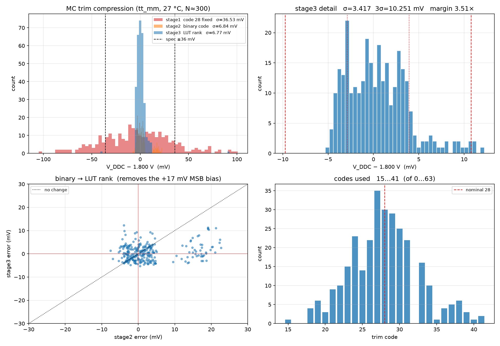
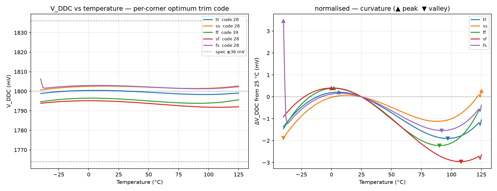

<!---
This file is used to generate your project datasheet.
-->

## How it works

This design integrates a high-precision **Bandgap Reference (BGR)** and a high-performance **Low-Dropout (LDO) Regulator** implemented in the SkyWater Sky130A 130nm CMOS process.

### 1. Bandgap Reference (BGR)
- **Topology**: Banba current-mode architecture generating a curvature-compensated reference voltage (~1.20 V).
- **Core Components**: Vertical PNP substrate BJT pairs ($Q_1, Q_2$), PMOS current mirrors, and matched high-sheet poly resistors.
- **Trimming (6-bit)**: 6-bit binary resistor trim network (`ui_in[7]`, `ui_in[3:0]`, `ui_in[6]`) providing a wide **2042.6 mV** tuning range with **8.4 mV LSB** resolution for post-silicon process and mismatch compensation.
- **Output**: Reference voltage is monitored via analog pin `ua[1]` (`VREF_LOW`).

### 2. Low-Dropout Regulator (LDO)
- **Input Supply**: 3.3 V high-voltage analog rail (`VAPWR`).
- **Regulated Output**: 1.8 V target output on analog pin `ua[0]` (`VDDC`, sensing output).
- **Error Amplifier (EA)**: Folded-Cascode topology powered directly from `VAPWR` (3.3 V) for rail-to-rail control and high gate drive margin.
- **Pass Transistor**: Sized PMOS power device optimized for low dropout voltage and wide load current range.
- **Diagnostics**: Integrated ring oscillator and frequency divider core for on-chip activity monitoring via digital output `uo[0]`.

---

## Performance Summary (Post-Layout PEX R+C Verified)

| Parameter | Specification / Conditions | Typical / Measured | Unit |
| :--- | :--- | :---: | :---: |
| **Input Supply Voltage ($V_{APWR}$)** | Analog 3.3V power rail | 3.3 | V |
| **Digital Supply Voltage ($V_{DPWR}$)** | Digital 1.8V power rail | 1.8 | V |
| **Target Output Voltage ($V_{DDC}$)** | Regulated output (code 28 nominal) | **1.8001** | V |
| **Reference Voltage ($V_{REF\_LOW}$)** | Bandgap core output (code 28 nominal) | **1.2052** | V |
| **Monte Carlo Dispersion ($3\sigma$)** | Mismatch-only, Stage 3 (LUT rank trim) | **10.251** (Spec: $\pm 36.0$) | mV |
| **Monte Carlo Yield** | Target window $\pm 36.0\text{ mV}$ ($\pm 2\%$) | **100.00** | % |
| **Loop Stability (PM / GM)** | Middlebrook dual injection (worst-case) | **69.52° / 11.49 dB** | deg / dB |
| **PSRR (DC / 100 kHz / 1 MHz)** | $V_{APWR}$ ripple rejection | **−56.5 / −27.7 / −9.2** | dB |
| **Load Transient (1 µs)** | On-chip sink step (SNK_EN: 0 $\rightarrow$ 1) | **−55.4 / +28.8** | mV |
| **Line Transient (10 µs)** | $V_{APWR}$ 3.0V $\leftrightarrow$ 3.6V step | **−2.49 / +1.95** | mV |
| **Temperature Drift (typ)** | tt / ss / ff, −40 to 125 °C, 166-pt sweep | **2.11 ~ 2.62 (7.1 ~ 8.8 ppm/°C)** | mV |
| **Temperature Drift (worst)** | `sf` 3.36 / `fs` 5.00, −40 to 125 °C | **5.00 (16.9 ppm/°C)** | mV |
| **Temperature Drift (0 to 70 °C)** | all corners, commercial range | **≤ 2.33** | mV |
| **VGND On-Chip IR Drop** | Max load current condition | **21.3** | mV |

> **Note on temperature behaviour**: measured with a 1 °C DC sweep from 125 °C down to −40 °C (166 points per corner), not a 3-point interpolation. The curve is third-order — it peaks near +5 °C, dips near +95 °C, and turns up again toward +125 °C. The `fs` corner (fast NMOS / slow PMOS) shows a sharp ~2.7 mV rise between −40 and −37 °C: the slow-PMOS mirror in the bandgap loses drive at low temperature. Above −37 °C it is as flat as the other corners (6.10 ppm/°C over −35…120 °C). Forward and reverse sweeps agree to 0.001 mV at −40 °C. All corners stay well inside the ±36 mV budget.

---

## 6-bit Trim & Calibration Procedure (★ LUT Rank Required)

Because TRIM5 (18,198 $\Omega$) slightly exceeds the sum of the lower 5 bits (17,886 $\Omega$) by 312 $\Omega$, the raw binary code sequence contains a non-monotonic step between code 31 and code 32 (+9.18 mV overlap). **For optimal post-silicon calibration, always apply trim codes in order of voltage-sorted LUT rank (`ldo/lut6.txt`).**

### Calibration Algorithm
1. Measure initial $V_{DDC}$ at default code 28 ($V_{nominal} \approx 1.800\text{ V}$).
2. Calculate target rank adjustment:
   $$\text{rank}_{new} = \text{rank}_{current} + \text{round}\left(\frac{V_{DDC} - 1.800\text{ V}}{8.377\text{ mV}}\right)$$
3. Program corresponding 6-bit trim code to external pins:
   $$\text{VTRIM}[5:0] = 63 - \text{code}$$
   *(Note: Input inverters invert the external pin state before the internal pass gates).*

### Representative LUT Trim Codes (Selection Table)

| Rank | Internal Code | Binary Code (`b5..b0`) | External `ui_in` Pattern | $V_{DDC}$ [V] | $V_{REF\_LOW}$ [V] |
| :---: | :---: | :---: | :---: | :---: | :---: |
| 1 | **00** | `000000` | `111111` | 2.043118 | 1.367783 |
| 10 | **09** | `001001` | `110110` | 1.964961 | 1.315461 |
| 20 | **19** | `010011` | `101100` | 1.879078 | 1.257963 |
| 27 | **26** | `011010` | `100101` | 1.818415 | 1.217355 |
| 28 | **27** | `011011` | `100100` | 1.809592 | 1.211486 |
| **29** | **★ 28 (Target)** | **`011100`** | **`100011`** | **1.800143** | **1.205153** |
| 30 | **29** | `011101` | `100010` | 1.791420 | 1.199283 |
| 31 | **32** | `100000` | `011111` | 1.783678 | 1.194100 |
| 32 | **30** | `011110` | `100001` | 1.783265 | 1.193824 |
| 33 | **33** | `100001` | `011110` | 1.774872 | 1.188243 |
| 34 | **31** | `011111` | `100000` | 1.774496 | 1.187953 |
| 40 | **37** | `100101` | `011010` | 1.739894 | 1.164788 |
| 50 | **47** | `101111` | `010000` | 1.653406 | 1.106887 |
| 63 | **62** | `111110` | `000001` | 1.523760 | 1.020092 |

---

## How to test

### Required Supplies & Power Up Sequence
1. Connect **`VGND`** to Ground (0 V).
2. Apply **`VAPWR` = 3.3 V** (Analog 3.3 V power rail).
3. Apply **`VDPWR` = 1.8 V** (Digital 1.8 V power rail).

### Pin Mapping & Operation

| Pin | Direction | Signal | Function | Note |
| :--- | :---: | :--- | :--- | :--- |
| **`ua[0]`** | Analog Out | `VDDC` | Regulated 1.8 V LDO Output | Sensing only (on-chip pass device) |
| **`ua[1]`** | Analog Out | `VREF_LOW` | 1.20 V Bandgap Reference Output | Reference monitoring |
| **`ui[0]`** | Digital In | `trim[1]` | BGR Trim Bit 1 | Internal code bit 1 |
| **`ui[1]`** | Digital In | `trim[2]` | BGR Trim Bit 2 | Internal code bit 2 |
| **`ui[2]`** | Digital In | `trim[3]` | BGR Trim Bit 3 | Internal code bit 3 |
| **`ui[3]`** | Digital In | `trim[4]` | BGR Trim Bit 4 | Internal code bit 4 |
| **`ui[4]`** | Digital In | `snk_en` | Current Sink Load Enable | Active High (connects on-chip load) |
| **`ui[5]`** | Digital In | `ro_en` | Ring Oscillator Test Enable | Active High |
| **`ui[6]`** | Digital In | `trim[5]` | BGR Trim Bit 5 (MSB) | Internal code bit 5 |
| **`ui[7]`** | Digital In | `trim[0]` | BGR Trim Bit 0 (LSB) | Internal code bit 0 |
| **`uo[0]`** | Digital Out | `div_out` | Divided RO Clock Output | Divide-by-16 diagnostic clock |

### Measurement Steps

1. Measure **`ua[0]`** (`VDDC`) with a DMM — nominally 1.800 V at code 28.
   This is the regulated output and drives 1.5 mA, so probe loading is
   negligible (a 100 kΩ load shifts it by only 0.019 mV).
2. Derive the reference from it rather than probing `ua[1]`:
   $$V_{REF\_LOW} = \frac{V_{DDC}}{1.4936}$$
   The divider ratio is constant to four decimal places across all five
   process corners.
3. Configure **`ui_in`** per the LUT table to verify trim steps and range.
4. Set **`ui[4]` = 1** (`snk_en`) for the on-chip ~1.5 mA sink load and
   observe load regulation.
5. Set **`ui[5]` = 1** (`ro_en`) to enable the ring oscillator and measure
   the divide-by-16 output on **`uo[0]`**. Output ripple while running is
   1.41 mV p-p on `V_DDC`.

### ★ Caution — `ua[1]` (`VREF_LOW`) is unbuffered

`VREF_LOW` connects directly to the error-amplifier gate with no output
buffer. Current drawn from this pin collapses the bandgap, and because the
LDO references it, the 1.8 V output follows:

| load on ua[1] | current | ΔV_REF | ΔV_DDC |
| :--- | ---: | ---: | ---: |
| 10 MΩ (typical DMM) | 0.12 µA | −14.0 mV | −20.9 mV |
| 5 MΩ (10 MΩ board + DMM) | 0.24 µA | −27.7 mV | −41.3 mV |
| 1 MΩ (1× scope probe) | 1.08 µA | −126.7 mV | −189.3 mV |

Demoboard revisions differ — the latest carries ESD diodes with no pull-down,
the previous one has 10 MΩ mounted. With the 10 MΩ board a standing −20.9 mV
offset is present even with nothing attached.

These are DC offsets and are absorbed by re-trimming (code 28 → 26 recovers
1.800 V under a 10 MΩ load, −2.97 mV residual), but the offset exists only
while the pin is loaded. **Leave `ua[1]` unconnected in normal use.** If it
must be measured directly, buffer it with a CMOS-input op-amp such as
OPA333 or LMP7721 (pA-range input bias current).
